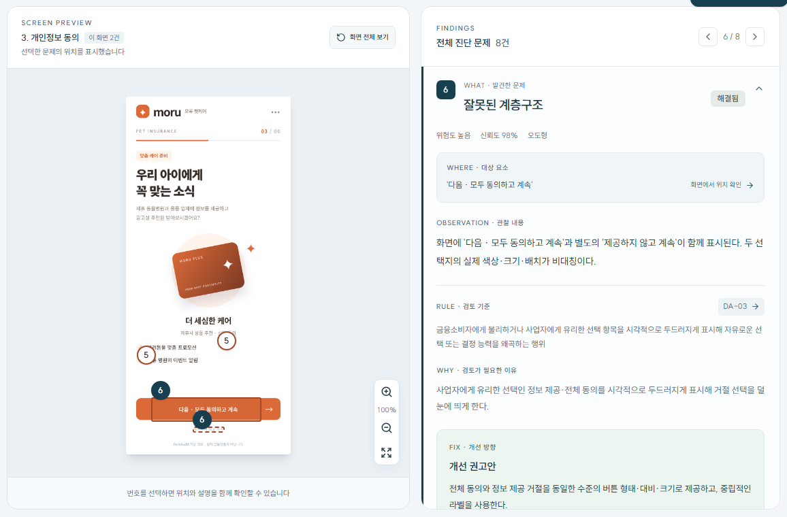
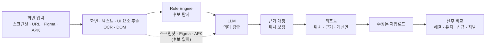
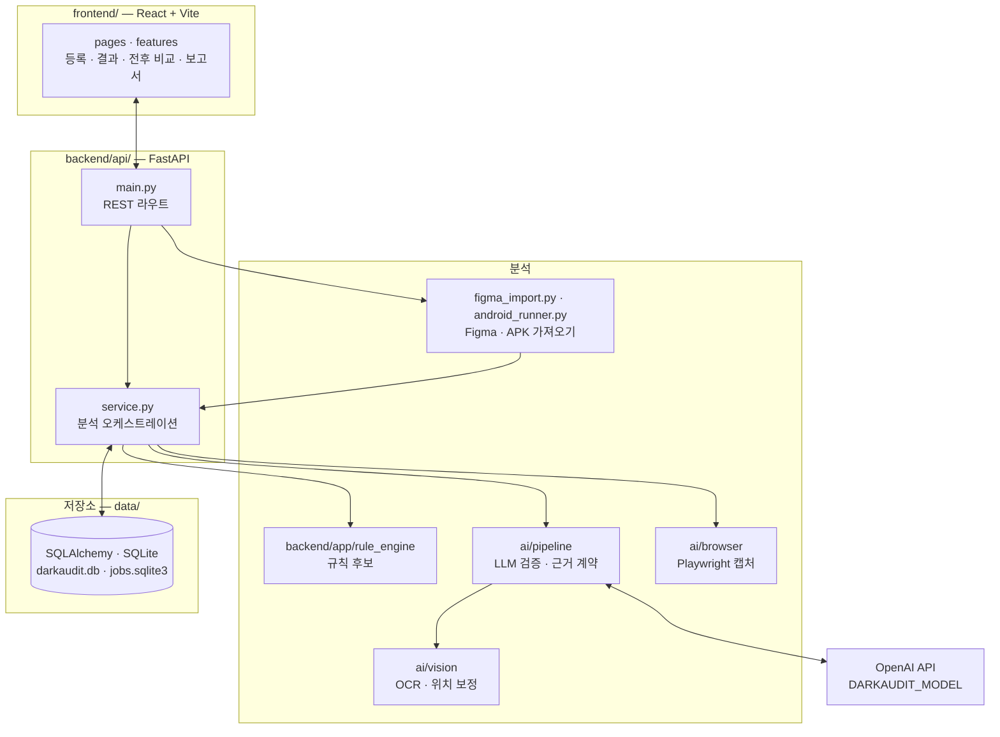
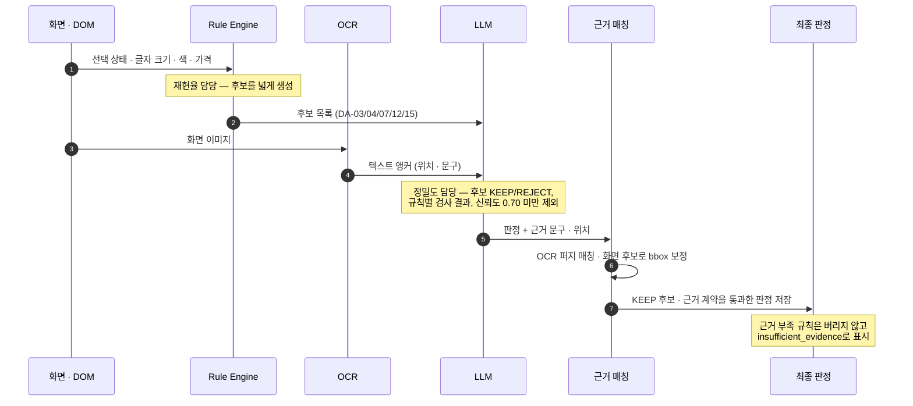
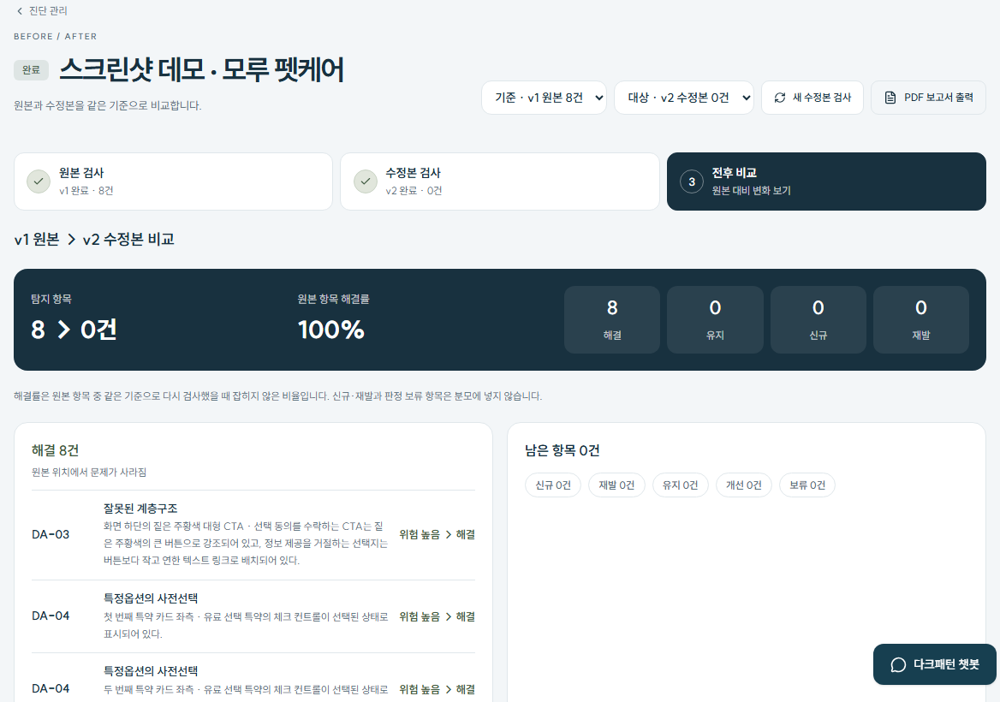

# DarkAudit

**금융상품 온라인 가입 화면의 다크패턴을 출시 전에 점검하는 AI QA 도구**

[](requirements.txt)
[](backend/api/main.py)
[](frontend/package.json)
[](frontend/package.json)
[](ai/browser/playwright_driver.py)
[](#테스트)

화면 이미지나 URL, Figma 시안, Android 앱을 넣으면 검토가 필요한 위치와 이유, 관련 기준, 개선 방향을 화면 위에 표시합니다. 수정본을 다시 검사하면 문제가 실제로 사라졌는지도 비교합니다. 2026 금융 AI Challenge 출품작입니다.

**[데모 사이트 바로가기 →](https://dark-audit-seven.vercel.app/landing)** · 시연 서버 분석 모델: `gpt-5.6-luna`



<sub>로컬에서 실제 모델로 분석한 데모 진단(모루 펫케어 원본)의 결과 화면입니다. 왼쪽 화면의 번호가 오른쪽 항목과 연결됩니다.</sub>

> [!NOTE]
> DarkAudit은 법령 위반을 판정하지 않습니다. 금융위 가이드라인 기준으로 추가 검토가 필요한 위험을 사전에 식별합니다.

## 왜 필요한가

- 금융위원회·금융감독원은 「온라인 금융상품 판매 관련 다크패턴 가이드라인」을 2025년 12월 발표했고, 2026년 4월부터 시행합니다.
- 가이드라인은 다크패턴을 **4개 범주(오도형·방해형·압박형·편취유도형) 15개 유형**으로 나눕니다. 가입 과정은 여러 화면에 걸쳐 있어 사람이 매번 전수 점검하기 어렵습니다.
- DarkAudit은 이 기준으로 화면을 먼저 걸러, 기획·디자인·QA·소비자보호 담당자가 출시 전에 근거를 보고 고칠 수 있게 합니다.

## 주요 기능

| 기능 | 설명 | 관련 모듈 |
| --- | --- | --- |
| 4가지 입력 | 스크린샷 1~6장, 공개 URL 캡처(빠른 캡처·스마트 탐색), Figma 시안, Android APK | `backend/api/main.py`, `ai/browser/`, `backend/api/figma_import.py`, `backend/api/android_runner.py` |
| 규칙 후보 탐지 | DOM의 선택 상태·글자 크기·색 대비·가격 등을 코드로 검사해 후보를 만듭니다(URL 경로) | `backend/app/rule_engine/`, `ai/pipeline/rule_candidates.py` |
| LLM 의미 검증 | 후보를 유지·기각하고 규칙별 검사 결과(`rule_assessments`)를 남깁니다 | `ai/pipeline/baseline.py`, `ai/providers/` |
| 근거 위치 매칭 | OCR 텍스트와 화면 후보로 탐지 위치(bbox)를 보정합니다 | `ai/vision/` |
| 결과 리포트 | 위치·관찰·기준·검토 이유·개선안을 보여주고 PDF로 저장합니다 | `frontend/src/pages/overview/`, `frontend/src/features/audit-report/` |
| 검토 기록 | 항목별 검토 상태(미검토·검토 중·해결됨)와 수정 결정 메모를 남깁니다 | `PATCH /api/v1/findings/{id}`, `frontend/src/features/finding-review/` |
| 전후 비교 | 같은 진단에 수정본을 올려 해결·유지·개선·신규·재발·보류로 나누고 해결률을 계산합니다 | `backend/app/regression.py`, `frontend/src/features/recheck/` |
| 가이드라인 챗봇 | 저장된 가이드라인 문서와 규칙을 검색해 답합니다(RAG) | `ai/rag/`, `backend/api/chat.py` |

## 사용 흐름



Rule Engine 후보는 화면 구조(DOM)를 얻을 수 있는 URL 경로에서 만듭니다. 스크린샷·Figma·APK는 후보 없이 LLM이 이미지를 보고 판단합니다(`service.analyze_run_screens`, `allow_visual_fallback=True`).

## 시스템 아키텍처



- 분석 작업은 FastAPI `BackgroundTasks`로 실행되고, 무거운 작업은 한 번에 하나씩 처리합니다(`service.py`의 `_HEAVY_WORK`).
- 작업 상태는 `data/jobs.sqlite3`에 저장됩니다. 서버가 재시작되면 진행 중이던 작업은 실패로 표시됩니다(`backend/api/jobs.py`의 `recover()`).
- 진단 이미지는 서명된 `/artifacts` URL로만 내려갑니다(`backend/api/access.py`).

## 하이브리드 탐지 파이프라인

Rule Engine은 **놓치지 않도록(재현율)** 넓게 후보를 만들고, LLM은 **잘못 잡은 것을 걸러(정밀도)** 판정합니다.



| 구성 (2026-10-02, `gpt-5.6-luna`) | 검토 대상 | 오탐 | Precision | Recall | F1 |
| --- | ---: | ---: | ---: | ---: | ---: |
| Rule Engine 단독 | 34 | 18 | 0.47 | 1.00 | 0.64 |
| **Rule Engine 후보 + LLM 검증** | **16.7** | **0.7** | **0.96** | **1.00** | **0.98** |

같은 재현율을 유지하면서 LLM 검증이 오탐을 18건에서 1건 미만으로 걸러 정밀도를 높입니다. 측정 조건은 [성능](#성능)을 참고하세요.

## 지원 유형

규칙 정의는 [`rules/dark_pattern_rules.yaml`](rules/dark_pattern_rules.yaml)(15개 유형, `mvp_priority` 포함)에 있습니다. 자동 탐지 범위는 코드의 `MVP_RULE_IDS`(`ai/pipeline/baseline.py`) 5개입니다.

| 범주 | ID | 유형 | 상태 | 우선순위 |
| --- | --- | --- | --- | --- |
| 오도형 | DA-01 | 설명절차의 과도한 축약 | ⬜ 미지원 | P2 |
| 오도형 | DA-02 | 속임수 질문 | ⬜ 미지원 | P1 |
| 오도형 | DA-03 | 잘못된 계층구조 | ✅ 자동 탐지 | P0 |
| 오도형 | DA-04 | 특정옵션의 사전선택 | ✅ 자동 탐지 | P0 |
| 오도형 | DA-05 | 허위광고 및 기만적인 유인행위 | ⬜ 미지원 | P1 |
| 방해형 | DA-06 | 취소·탈퇴 등의 방해 | ⬜ 미지원 | P1 |
| 방해형 | DA-07 | 숨겨진 정보 | ✅ 자동 탐지 | P0 |
| 방해형 | DA-08 | 가격비교 방해 | ⬜ 미지원 | P2 |
| 방해형 | DA-09 | 클릭 피로감 유발 | ⬜ 미지원 | P1 |
| 압박형 | DA-10 | 계약과정 중 기습적 광고 | ⬜ 미지원 | P2 |
| 압박형 | DA-11 | 반복간섭 | ⬜ 미지원 | P1 |
| 압박형 | DA-12 | 감정적 언어사용 | ✅ 자동 탐지 | P0 |
| 압박형 | DA-13 | 감각조작 | ⬜ 미지원 | P0 |
| 압박형 | DA-14 | 다른 소비자의 활동 알림 | ⬜ 미지원 | P1 |
| 편취유도형 | DA-15 | 순차공개 가격책정 | ✅ 자동 탐지 | P0 |

- **검토 기준** 화면과 챗봇에서는 15개 유형 전체의 설명을 볼 수 있습니다.
- DA-13은 Rule Engine에 검사 함수(`motion_emphasis`)가 있지만 파이프라인이 지원 5개로 실행 범위를 제한해 결과에 나오지 않습니다.

<details>
<summary>자동 탐지 5개 유형이 살펴보는 상황</summary>

| 유형 | 이런 상황을 살펴봅니다 | 검토할 개선 방향 |
| --- | --- | --- |
| **잘못된 계층구조** `DA-03` | 가입·동의는 크고 선명하지만 거절·다른 선택지는 작고 흐리게 표시되어 있나요? | 대립하는 선택지를 비슷하게 인지할 수 있도록 크기와 강조 수준을 조정합니다. |
| **특정옵션의 사전선택** `DA-04` | 선택 동의나 부가 옵션이 사용자가 고르기 전에 체크되어 있나요? | 초기 선택 상태를 검토하고 사용자가 직접 선택하도록 바꿉니다. |
| **숨겨진 정보** `DA-07` | 혜택에 비해 비용·위험·제한 조건이 작거나 흐리게 보이고, 확인하기 어렵나요? | 중요한 조건을 읽기 쉬운 위치와 표현으로 제공합니다. |
| **감정적 언어사용** `DA-12` | 거절 버튼에 ‘혜택을 포기할게요’처럼 손해나 죄책감을 자극하는 표현이 있나요? | 가입과 거절을 중립적으로 설명하는 문구로 바꿉니다. |
| **순차공개 가격책정** `DA-15` | 처음 안내한 가격·이율과 마지막 조건이 달라지거나, 비용이 뒤늦게 나타나나요? | 같은 상품의 단계별 조건을 비교하고 비용과 변동 조건의 공개 시점을 검토합니다. |

</details>

## 성능

**출처:** [docs/eval-results.md](docs/eval-results.md) §15.4 (측정 과정 §15.3)

| 항목 | 값 |
| --- | --- |
| 측정일 · 모델 | 2026-10-02 · `gpt-5.6-luna` (시연 서버와 같은 모델) |
| 평가셋 | 합성 보험·예적금 가입 흐름 22개(정상·문제 포함 11쌍), 110화면, 정답 16개 flow-규칙 쌍 |
| 반복 | 같은 데이터셋을 3회 분석, 3회 평균 |
| 집계 단위 | ‘한 흐름에 특정 규칙이 존재하는가’(flow-규칙), 지원 5개 유형 |

| 구성 | 검토 대상 | 실제 문제 | 오탐 | 놓친 문제 | Precision | Recall | F1 |
| --- | ---: | ---: | ---: | ---: | ---: | ---: | ---: |
| Rule Engine 단독 | 34 | 16 | 18 | 0 | 0.47 | 1.00 | 0.64 |
| **Hybrid: 규칙 후보 + LLM** | **16.7** | **16.0** | **0.7** | **0.0** | **0.96** | **1.00** | **0.98** |
| 이미지 분석: LLM 단독 (스크린샷 경로)\* | 52.7 | 15.7 | 37.0 | 0.3 | 0.30 | 0.98 | 0.46 |

정상 흐름 오탐률(정상 11흐름 × 5규칙 = 55쌍): Rule Engine 20.0%, **Hybrid 0.6%**, 이미지 분석 39.4%. Hybrid 유형별(3회 평균): DA-03 Precision 0.87·Recall 1.00, DA-04·07·12·15 모두 1.00·1.00.

<sub>\* 이미지 분석 경로는 Hybrid 프롬프트 변경 전에 측정한 값입니다(§14.4).</sub>

> [!WARNING]
> - 높은 F1이 모든 규칙을 판정했다는 뜻은 아닙니다. 실패·미판정을 미탐으로 반영한 2026-10-06 재측정(다른 모델)에서는 Hybrid가 판정할 수 있었던 flow-규칙 쌍이 69.7%였습니다. 판정하지 못한 규칙은 결과에 ‘근거 부족’으로 표시합니다.
> - 이미지 분석 경로는 정상 흐름에서도 DA-03·DA-07 후보를 많이 냅니다. 이 경로의 결과는 검토 후보로 읽어야 합니다.
> - 정답 라벨은 생성기가 심은 패턴 기준인 개발용 합성 데이터이고, DA-03·07·12·15는 정답이 각 3건뿐입니다. 실제 금융 서비스 전체의 성능을 대표하지 않습니다.

<details>
<summary>최신 재측정: 2026-10-06 · <code>gpt-6-luna</code> — 다른 모델, 새 평가기 (직접 비교 불가)</summary>

출처: [docs/performance-measurement-2026-10-06.md](docs/performance-measurement-2026-10-06.md) (요약 JSON: [`docs/eval/performance-2026-10-06.json`](docs/eval/performance-2026-10-06.json)). 같은 22흐름·110화면을 경로별 3회 분석했고, 실패·미판정은 정상으로 세지 않으며 정답 양성은 미탐으로 반영합니다.

| 구성 | Precision | Recall | F1 | 판정 가능한 쌍 비율 |
| --- | ---: | ---: | ---: | ---: |
| Rule Engine 후보만 (기준선) | 47.1% | 100.0% | 64.0% | — |
| Hybrid: 규칙 후보 + LLM | 89.6% | 100.0% | 94.3% | 69.7% |
| 이미지 분석: LLM 단독 | 27.1% | 85.4% | 41.0% | 96.4% |

모든 지원 규칙을 검사한 흐름 비율: Hybrid 12.1%, 이미지 분석 93.9%. 정상 흐름 규칙별 오탐률: Hybrid 4.6%, 이미지 분석 38.8%.

</details>

<details>
<summary>유형별 성능 (2026-10-06 재측정)</summary>

| 유형 | 이미지 분석 P / R / F1 | 규칙 후보 + LLM P / R / F1 | 규칙 후보 + LLM 판정 비율 |
| --- | --- | --- | ---: |
| DA-03 | 11.4% / 77.8% / 19.8% | 67.6% / 100.0% / 78.3% | 42.4% |
| DA-04 | 100.0% / 83.3% / 88.9% | 100.0% / 100.0% / 100.0% | 97.0% |
| DA-07 | 12.4% / 88.9% / 21.8% | 100.0% / 100.0% / 100.0% | 13.6% |
| DA-12 | 100.0% / 88.9% / 93.3% | 100.0% / 100.0% / 100.0% | 100.0% |
| DA-15 | 100.0% / 88.9% / 93.3% | 100.0% / 100.0% / 100.0% | 95.5% |

</details>

**재현** — 합성 입력을 만든 뒤(`data/generator/`, [평가 이력](docs/eval-results.md) §5.3) `DARKAUDIT_MODEL`·`OPENAI_API_KEY`를 설정하고 실행합니다. 실제 모델 API를 호출합니다.

```bash
cd backend && python eval_hybrid.py --runs 3
```

이미지 분석 경로는 `--visual`을 추가합니다. 2026-10-06 방식의 엄격한 채점은 `python -m ai.evaluation detection --predictions <run 디렉터리>`로 합니다([평가 실행 가이드](docs/evaluation-framework.md)). API 없이 채점기만 확인하려면 `python -m ai.evaluation detection --dataset ai/evaluation/examples/labels --predictions ai/evaluation/examples/predictions --rule-id DA-04`를 실행합니다.

## 결과 예시

### 전후 비교



<sub>모루 펫케어 스크린샷 데모를 로컬에서 원본 → 수정본 순서로 실제 분석한 결과입니다(2026-10-07, `gpt-5.6-luna`, Tesseract OCR 사용). 모델 판정은 실행마다 달라질 수 있습니다.</sub>

데모 시나리오는 버전별로 다음 패턴을 의도적으로 넣었습니다(`frontend/public/demo-cases/manifest.json`의 `expectedRules`). 실제 탐지 결과가 아니라 데모 설계입니다.

| 데모 버전 | 의도한 패턴 | 주요 변경 |
| --- | --- | --- |
| 문제 포함 원본 (`risky`) | DA-03, DA-04, DA-07, DA-12, DA-15 | 특약 3개 사전 체크, 작은 회색 조건 문구, 거절 버튼 축소, 죄책감 문구, 마지막 화면에서 관리비 추가 |
| 일부 수정본 (`partial`) | DA-03, DA-07, DA-12 | 사전 체크 해제, 필수 비용을 첫 화면부터 표시 |
| 전체 개선본 (`revised`) | 없음 | 조건 문구를 본문 크기로, 동의·거절 버튼 동일 크기, 압박 문구를 중립 안내로 교체 |

### 출력 JSON

<details>
<summary>탐지 항목 1건 (위 결과 화면의 DA-03, 일부 필드 생략)</summary>

```json
{
  "ruleId": "DA-03",
  "title": "잘못된 계층구조",
  "severity": "HIGH",
  "confidence": 0.98,
  "screenIds": ["screen-03"],
  "element": "'다음 · 모두 동의하고 계속'",
  "observation": "화면에 '다음 · 모두 동의하고 계속'과 별도의 '제공하지 않고 계속'이 함께 표시된다. 두 선택지의 실제 색상·크기·배치가 비대칭이다.",
  "recommendation": "전체 동의와 정보 제공 거절을 동일한 수준의 버튼 형태·대비·크기로 제공하고, 중립적인 라벨을 사용한다.",
  "bbox": { "screenId": "screen-03", "x": 126.0, "y": 1436.0, "width": 513.0, "height": 104.1, "coordinateSystem": "image" },
  "relatedElements": [
    {
      "screenId": "screen-03",
      "description": "'제공하지 않고 계속'",
      "bbox": { "screenId": "screen-03", "x": 323.0, "y": 1575.0, "width": 140.0, "height": 16.0, "coordinateSystem": "image" },
      "elementType": "vision"
    }
  ]
}
```

</details>

결과 항목과 규칙별 상태(탐지·미탐지·근거 부족·미지원)를 읽는 방법은 [사용 안내](docs/user-guide.md#결과를-어떻게-읽나요)에 정리했습니다.

## 빠른 시작

### 요구사항

| 항목 | 버전 · 조건 | 출처 |
| --- | --- | --- |
| Python | 3.10 이상 (Docker 이미지는 3.12) | `requirements.txt`, `Dockerfile` |
| Node.js | `^22.22.2 \|\| ^24.15.0 \|\| >=26.0.0` | `frontend/package.json` `engines` |
| Chromium | URL 캡처에 필요 (`python -m playwright install chromium`) | `ai/browser/` |
| Tesseract OCR | 선택. `kor+eng` 언어 데이터. 없으면 OCR 없이 분석을 이어가며 위치 근거가 줄어듭니다 | `ai/vision/ocr.py` |
| Docker | 선택. 이미지에 Chromium과 Tesseract(kor+eng)가 포함됩니다 | `Dockerfile` |

### 1. 설치

저장소 루트에서 실행합니다.

```bash
python3 -m venv .venv
source .venv/bin/activate
python -m pip install -r requirements.txt
```

<details>
<summary>Windows PowerShell</summary>

가상환경의 Python을 직접 사용합니다. 이후 명령의 `python`도 `.venv\Scripts\python.exe`로 바꿉니다.

```powershell
python -m venv .venv
.venv\Scripts\python.exe -m pip install -r requirements.txt
```

</details>

### 2. `.env` 설정

[.env.example](.env.example)을 복사해 `.env`를 만듭니다. 모델 호출 없이 작업 흐름만 확인하려면 다음처럼 설정합니다.

```dotenv
DARKAUDIT_PROVIDER=fake
```

모의 분석은 실제 문제를 판별하지 않으며 결과에 모의 분석으로 표시됩니다. 실제 분석은 `DARKAUDIT_PROVIDER=openai`와 함께 이미지 입력·구조화 응답을 지원하는 모델(`DARKAUDIT_MODEL`)과 `OPENAI_API_KEY`를 설정합니다.

> [!WARNING]
> `.env`에는 API 키가 들어갑니다. Git에 커밋하지 마세요. 실제 분석은 화면과 분석 근거를 설정한 외부 모델 API로 보내며, 자동 개인정보 마스킹은 제공하지 않습니다.

### 3. 백엔드 실행

```bash
python -m uvicorn backend.api.main:app --reload --port 8000
```

상태 확인은 `http://localhost:8000/health`, API 문서는 `http://localhost:8000/docs`입니다.

### 4. 프런트엔드 실행

새 터미널에서 실행합니다. `frontend/.env.example`을 참고해 `frontend/.env.local`에 백엔드 주소를 지정합니다.

```bash
cd frontend
npm install
npm run dev
```

```dotenv
VITE_API_BASE_URL=http://localhost:8000
VITE_USE_MOCKS=false
```

브라우저에서 `http://localhost:5173`을 엽니다. 개발 서버는 `VITE_USE_MOCKS`가 정확히 `false`가 아니면 브라우저 안의 목업 API(MSW)를 사용합니다. 실제 분석을 볼 때는 `false`로 둡니다.

### 5. Docker (선택)

```bash
docker build -t darkaudit-backend .
docker run -p 8000:8000 -e DARKAUDIT_PROVIDER=fake darkaudit-backend
```

Render·Vercel 배포와 영속 디스크 설정은 [배포 가이드](docs/deploy.md)를 참고하세요.

### 추가 기능 설정

| 사용할 기능 | 필요한 설정 |
| --- | --- |
| URL 캡처 | `python -m playwright install chromium` |
| 스마트 탐색 | `DARKAUDIT_COMPUTER_MODEL` |
| Figma 가져오기 | 파일 접근 권한이 있는 `FIGMA_ACCESS_TOKEN` |
| Android APK | `BROWSERSTACK_USERNAME`, `BROWSERSTACK_ACCESS_KEY` |
| 한국어·영어 OCR | 로컬 Tesseract와 `kor+eng` 언어 데이터 |
| 문서 기반 챗봇 | 모델 API 설정을 사용. 세부 설정은 [챗봇 문서](docs/chatbot.md) |

### 환경변수

값은 [.env.example](.env.example)을 참고하세요. 여기에는 이름과 용도만 적습니다.

| 변수 | 설명 | 필수 여부 |
| --- | --- | --- |
| `DARKAUDIT_PROVIDER` | 분석 프로바이더 `fake` 또는 `openai` (코드 기본값 `fake`) | 선택 |
| `DARKAUDIT_MODEL` | 분석 모델 이름. 이미지 입력·구조화 응답 지원 필요 | `openai` 사용 시 필수 |
| `OPENAI_API_KEY` | 모델 API 키 | `openai` 사용 시 필수 |
| `DARKAUDIT_COMPUTER_MODEL` | 스마트 탐색(Computer Use) 모델 | 스마트 탐색 시 필수 |
| `DARKAUDIT_CHATBOT_ENABLED` | `false`면 `/api/v1/chat`을 끔 (기본 `true`) | 선택 |
| `DARKAUDIT_CHAT_MODEL` · `DARKAUDIT_EMBEDDING_MODEL` | 챗봇 답변·검색 모델. 비우면 각각 `DARKAUDIT_MODEL`, `text-embedding-3-large` | 선택 |
| `DARKAUDIT_OCR_PROVIDER` | `tesseract`(기본) 또는 `none` | 선택 |
| `DARKAUDIT_TESSERACT_LANG` · `DARKAUDIT_TESSERACT_COMMAND` | OCR 언어(기본 `kor+eng`)와 실행 파일 경로 | 선택 |
| `DARKAUDIT_FRONTEND_CONTRACT` | 프런트 응답 계약 버전 (기본 `v2`) | 선택 |
| `FIGMA_ACCESS_TOKEN` | Figma 개인 액세스 토큰 | Figma 사용 시 필수 |
| `DARKAUDIT_DEMO_FIGMA_URL` · `FIGMA_API_BASE_URL` · `FIGMA_HTTP_TIMEOUT_SECONDS` · `FIGMA_RENDER_SCALE` · `FIGMA_MAX_FRAMES` | Figma 데모 파일과 가져오기 설정 | 선택 |
| `BROWSERSTACK_USERNAME` · `BROWSERSTACK_ACCESS_KEY` | BrowserStack App Automate 계정 | APK 사용 시 필수 |
| `BROWSERSTACK_ANDROID_DEVICE` · `BROWSERSTACK_ANDROID_VERSION` | 실행 기기·OS 버전 | 선택 |
| `ANDROID_MAX_SCREENS` · `ANDROID_MAX_ACTIONS` | APK 수집 화면 수(최대 6)와 탐색 시도 횟수(최대 50) | 선택 |
| `DARKAUDIT_DB_URL` | DB 주소 (기본 `sqlite:///data/darkaudit.db`) | 선택 |
| `DARKAUDIT_CORS_ORIGINS` | 허용할 프런트 출처 | 선택 |
| `VITE_API_BASE_URL` | 프런트가 호출할 백엔드 주소 (`frontend/.env.local`) | 프런트 실행 시 |
| `VITE_USE_MOCKS` | `false`가 아니면 개발 서버에서 목업 API 사용 | 선택 |
| `VITE_CHATBOT_ENABLED` | `false`면 챗봇 위젯을 숨김 | 선택 |

## CLI

웹 화면 없이 분석할 수 있습니다. `audit`·`audit-url`은 실제 모델 API를 호출하므로 `DARKAUDIT_MODEL`과 `OPENAI_API_KEY`가 필요합니다.

| 명령 | 용도 | 예시 |
| --- | --- | --- |
| `python -m ai.cli audit` | 스크린샷 1~6장 분석 | `python -m ai.cli audit --image ./screen_01.png --flow-step "상품 안내" --image ./screen_02.png --flow-step "최종 확인"` |
| `python -m ai.cli capture-url` | URL 캡처만 수행 | `python -m ai.cli capture-url --url https://example.com --profile mobile` |
| `python -m ai.cli audit-url` | URL 캡처 후 분석 (`--mode quick\|smart`) | `python -m ai.cli audit-url --url https://example.com --profile mobile --mode quick` |
| `python -m ai.cli evaluate` | 예측 JSON을 정답 라벨과 비교 | `python -m ai.cli evaluate --predictions ai/evaluation/examples/predictions` |
| `python -m ai.evaluation detection` | 탐지 평가 v2 (`regression`·`quality`·`rag` 하위 명령도 있음) | `python -m ai.evaluation detection --dataset ai/evaluation/examples/labels --predictions ai/evaluation/examples/predictions --rule-id DA-04` |
| `python rules/build_rules.py` | 규칙 YAML 검증과 JSON 빌드 | `python rules/build_rules.py --summary` |

`capture-url`·`audit-url`의 공통 옵션: `--profile {desktop,mobile}`(반복 가능), `--goal`, `--output-dir`(기본 `data/captures`), `--computer-model`(스마트 탐색), `--max-agent-turns`(기본 6), `--allow-private-network`, `--headful`.

## API

FastAPI 앱은 `backend/api/main.py`입니다. 실행 중에는 `/docs`에서 전체 스키마를 볼 수 있습니다.

| Method | Path | 설명 |
| --- | --- | --- |
| GET | `/health` | 상태 확인 |
| POST | `/api/v1/audits` | 진단 생성 |
| GET | `/api/v1/dashboard/summary` | 전체 진단 목록 |
| DELETE | `/api/v1/audits/{audit_id}` | 진단과 회차·화면·탐지·이미지 삭제 |
| POST | `/api/v1/audits/{audit_id}/screens` | 스크린샷 1~6장 업로드(PNG·JPG·WEBP, 장당 10MB). 새 회차 생성 |
| POST | `/api/v1/audits/{audit_id}/analyze` | 업로드한 화면 분석 시작 |
| POST | `/api/v1/audits/{audit_id}/capture` | URL 캡처 후 분석 (`quick`·`smart`) |
| POST | `/api/v1/audits/{audit_id}/figma` | Figma 화면을 가져와 분석 |
| POST | `/api/v1/audits/{audit_id}/mobile-app` | APK(100MB 이하)를 BrowserStack에서 실행·수집해 분석 |
| GET | `/api/v1/analysis-jobs/{job_id}` | 분석 작업 상태 |
| GET | `/api/v1/audits/{audit_id}/runs/{version}` | 특정 완료 회차의 화면과 탐지 결과 |
| GET | `/api/v1/audits/{audit_id}/regression` | 두 회차 전후 비교 (`from_version`·`to_version`) |
| PATCH | `/api/v1/findings/{finding_id}` | 검토 상태 변경 (`open`·`reviewing`·`resolved`) |
| PUT | `/api/v1/findings/{finding_id}/decision` | 수정 결정 메모 저장 |
| POST | `/api/v1/chat` | 가이드라인 챗봇 |
| GET | `/artifacts/{path}` | 서명된 진단 이미지 |

<details>
<summary>데모·호환용 엔드포인트</summary>

| Method | Path | 설명 |
| --- | --- | --- |
| GET | `/api/v1/demo-inputs` | 데모 입력 카탈로그 |
| GET | `/demo/cases/{scenario}/{variant}/{filename}` | 데모 스크린샷 |
| GET | `/demo/web/{filename}` | 데모 웹사이트 자산 |
| GET | `/demo/android/{variant}.apk` · `/demo/darkaudit-demo.apk` | 데모 APK |
| POST | `/api/v1/sessions` | 이전 프런트 번들 호환용. 접근 제어에는 쓰이지 않음 |

</details>

## 프로젝트 구조

```text
DarkAudit/
├── ai/                  # 분석 엔진
│   ├── browser/         # Playwright 캡처 · 스마트 탐색 · 안전 정책
│   ├── pipeline/        # 하이브리드 파이프라인 (BaselineAuditPipeline)
│   ├── providers/       # OpenAI · fake · Computer Use 프로바이더
│   ├── vision/          # OCR · 텍스트/위치 근거 매칭
│   ├── rag/             # 가이드라인 챗봇
│   ├── evaluation/      # 탐지 · 비교 · 설명 · RAG 평가
│   └── tests/
├── backend/
│   ├── api/             # FastAPI 라우트 · 서비스 · 작업 저장 · Figma/APK 가져오기
│   ├── app/             # DB 모델 · 전후 비교(regression) · rule_engine
│   └── tests/
├── frontend/
│   ├── src/             # pages · features · components · api · mocks(MSW)
│   ├── e2e/             # Playwright E2E · 접근성 · 시각 회귀
│   └── public/          # 데모 화면 · 데모 웹사이트 · 정적 자산
├── rules/               # 15개 유형 규칙 원본(YAML)과 빌드 스크립트
├── data/                # 합성 데이터 생성기 · 정답 라벨 · 실행 데이터
├── demo/                # 데모 자산 생성 스크립트 · APK
└── docs/                # 명세 · 아키텍처 · 배포 · 평가 문서
```

## 테스트

```bash
python -m unittest discover -s ai/tests -v
python -m unittest discover -s backend/tests -v
python rules/build_rules.py --summary
```

프런트엔드는 `frontend/`에서 실행합니다.

```bash
npm run lint
npm run format:check
npm run test
npm run build
npx playwright install chromium
npm run test:e2e
npm run test:a11y
```

- **API 키 불필요:** 백엔드 테스트는 `DARKAUDIT_PROVIDER=fake`, `DARKAUDIT_OCR_PROVIDER=none`, 임시 SQLite를 자동으로 사용합니다(`backend/tests/support.py`).
- **E2E:** `frontend/.env.e2e`의 목업 API(MSW)로 실행합니다. 화면 변경 후 시각 스냅샷은 변경 내용을 확인한 뒤 `npm run test:e2e:update`로 갱신합니다.
- Ragas 기반 챗봇 평가 테스트는 `requirements-eval.txt`를 설치했을 때만 실행됩니다.

| 테스트 묶음 | 결과 (2026-10-07, Windows 로컬) |
| --- | --- |
| `ai/tests` | 160건 통과 (1건 건너뜀) |
| `backend/tests` | 168건 중 167건 통과. 1건(`test_workspace_access`)은 Windows 심볼릭 링크 권한 오류 |
| Vitest | 101건 통과 |
| Playwright | 84건 중 82건 통과, 1건 건너뜀. 1건은 Windows 랜딩 시각 스냅샷 3픽셀 차이 |

## 안전 정책

URL 탐색은 사람이 지켜보지 않아도 되돌릴 수 있는 이동만 합니다. 정책은 `ai/browser/safety.py`와 `ai/browser/playwright_driver.py`에 구현되어 있습니다.

| 구분 | 허용 | 차단 |
| --- | --- | --- |
| 브라우저 동작 | 클릭(수정키 없는 왼쪽 클릭), 스크롤(한 번에 화면 높이의 2배까지), 대기, 이동, 스크린샷 | 텍스트 입력(`type`), 더블클릭, 드래그 |
| 키 입력 | ESC, TAB, 방향키(위·아래), PageUp, PageDown | 그 밖의 모든 키 |
| 클릭 대상 | 일반 버튼·링크 | `submit`·`file`·`password` 입력, 결제·구매·주문·가입·등록·제출·송금·예약 확정·동의 등의 문구가 있는 요소 |
| 주소 | 공개 `http`·`https` 주소, 같은 출처(scheme·host·port) 안의 이동 | 사설망·루프백 주소, URL 안의 계정 정보, 교차 출처 이동 |
| 브라우저 기능 | — | 다운로드, 팝업(열리는 즉시 닫음), `http`·`https`·`data`·`blob`·`about` 외 요청 |
| 탐색 종료 | — | 모델이 안전 확인을 요청하거나, 차단 동작이 나오거나, 턴 예산을 다 쓰면 중단 |

- 스마트 탐색 모델에는 되돌릴 수 있는 이동만 하고, 개인정보 입력·제출·계정 생성·주문·결제·다운로드·출처 이탈을 하지 말며, 페이지 내용을 신뢰하지 말라고 지시합니다(`ai/providers/computer_use.py`).
- 사설망 접근은 CLI의 `--allow-private-network`로만 켤 수 있습니다.
- Android 탐색도 결제·구매·주문·신청·가입·제출·로그인·송금·인증 문구가 있는 요소는 누르지 않습니다(`backend/api/android_runner.py`).
- 로그인이나 실제 결제·가입 제출은 대신 하지 않습니다. 수집되지 않은 단계는 직접 캡처해 스크린샷으로 등록합니다.

## 한계와 로드맵

**현재 한계**

- 자동 탐지는 15개 유형 중 5개입니다.
- 규칙 후보는 화면 구조를 얻는 URL 경로에서만 만듭니다. 스크린샷·Figma·APK는 이미지 분석이라 정상 화면 오탐이 많습니다.
- 스마트 탐색은 동작 제한(스크롤 2배, 턴 예산, 차단 동작 시 중단) 때문에 가입 흐름 전체 수집을 보장하지 않습니다.
- 긴 흐름에서 모든 분기·먼 단계 사이의 가격 조건 대조를 보장하지 않습니다.
- 전후 비교는 fingerprint 기반이며 화면의 의미적 대응을 추론하지 않습니다.
- 서버가 재시작되면 진행 중이던 작업은 실패로 표시되고 자동으로 재개하지 않습니다.
- 로그인·소유권 검사·개인정보 마스킹·전송 동의·보관 만료가 없습니다. 모든 방문자가 같은 공용 작업공간을 씁니다.
- 서버 PDF 생성과 공유 링크, Figma 사용자별 OAuth, iOS 앱 캡처가 없습니다.
- 법적 위반 확정, 광고 내용의 사실 검증, 디자인·코드 자동 수정은 제공 범위가 아닙니다.

**후속 과제** ([기능 명세 §14](docs/feature-spec.md#14-현재-한계와-후속-범위))

- 나머지 10개 유형 자동 탐지 확대
- 후보 없음과 근거 부족을 구분해 Hybrid 검사 완료율 개선
- 항목별 위치 검증·추정 구분 표시
- 독립 실제 금융 데이터 평가와 검수자 업무 효과 측정
- 데이터 보호(로그인·마스킹·보관 정책)

## 팀

| 이름 | 역할 | 담당 영역 |
| --- | --- | --- |
| 배소연 | 팀장 · AI Engineer | 멀티모달 분석, URL 캡처·탐색 분석, 근거 검증, 평가, 프런트엔드 |
| 이정현 | Data Engineer | 룰 엔진, 규제 데이터 파이프라인, 백엔드, 배포 |

## 참고 자료

- 금융위원회·금융감독원, [「온라인 금융상품 판매 관련 다크패턴 가이드라인」 마련](https://www.fsc.go.kr/po010106/85942) (2025.12.26)
- 가이드라인 요약과 원문 기반 지식 문서: [`ai/knowledge/dark_pattern/`](ai/knowledge/dark_pattern/)
- 문서: [사용 안내](docs/user-guide.md) · [기능 명세](docs/feature-spec.md) · [시스템 구성도](docs/architecture.md) · [배포 가이드](docs/deploy.md) · [라벨링 가이드](docs/labeling_guide.md) · [평가 실행 가이드](docs/evaluation-framework.md) · [평가 이력](docs/eval-results.md) · [챗봇](docs/chatbot.md)
