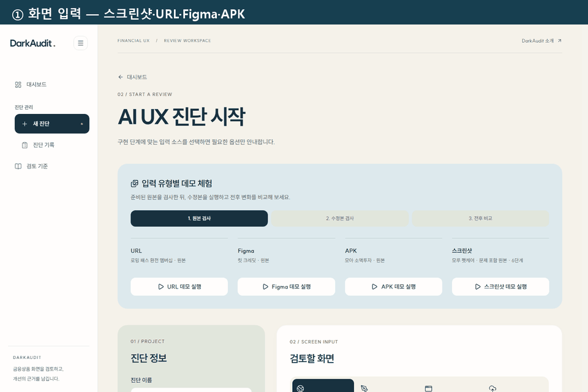
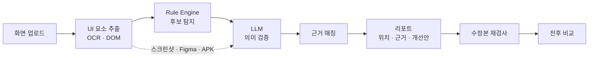
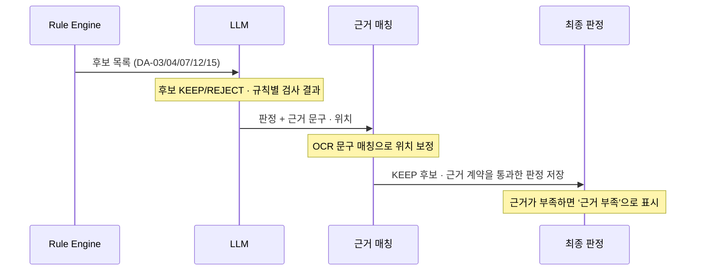
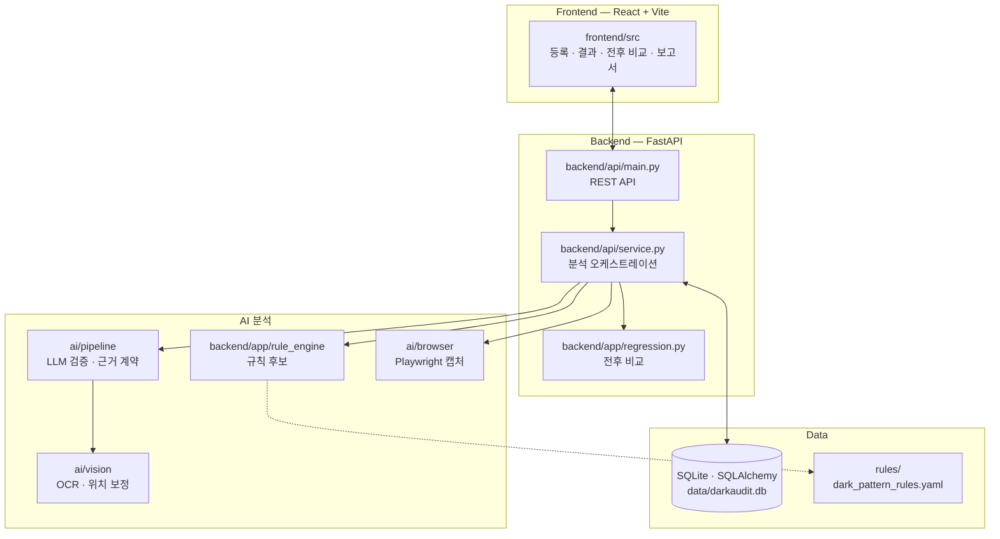

# DarkAudit

**금융상품 가입 화면의 다크패턴을 출시 전에 찾아주는 AI QA 도구**

### [🔗 서비스 바로가기 →](https://dark-audit-seven.vercel.app/landing)

| 자동 탐지 유형 | Hybrid F1 | 펫케어 데모 전후 비교 |
| :---: | :---: | :---: |
| **5 / 15** (금융위 가이드라인) | **0.98** (Precision 0.96 · Recall 1.00) | **8건 중 8건 해결** (2회차 7건 중 6건) |

> [!NOTE]
> DarkAudit은 법령 위반을 판정하지 않고, 금융위 가이드라인 기준으로 검토가 필요한 위험을 찾아줍니다.

## 문제와 해결

| 지금의 문제 | DarkAudit의 해결 |
| --- | --- |
| 「온라인 금융상품 판매 관련 다크패턴 가이드라인」이 2026년 4월 시행. 4개 범주 15개 유형을 화면마다 확인해야 함 | 15개 유형을 규칙으로 정리하고, 그중 5개 유형을 자동으로 찾아 화면 위 위치·근거·개선안을 제시 |
| 여러 화면에 걸친 가입 흐름을 사람이 수작업으로 점검 | 스크린샷·URL·Figma·APK를 넣으면 흐름 전체를 한 번에 검사 |
| 화면을 고칠 때마다 처음부터 다시 검토 | 같은 진단에 수정본을 올리면 해결·유지·신규·재발을 자동으로 비교 |

## 동작 흐름

화면 구조(DOM)를 얻는 URL 경로는 규칙 후보를 거치고, 이미지 입력은 LLM이 화면을 직접 판단합니다.

## AI 설계: 왜 Hybrid인가

| 담당 | 하는 일 | 이유 |
| --- | --- | --- |
| **Rule Engine** | 관찰 가능한 사실 계산: 체크 여부, 단계별 가격 비교, 버튼 크기·색 대비 | 결정적이라 놓치지 않음 → **재현율** 담당 |
| **LLM** | 의미 해석: 문구의 압박감, 선택지 사이의 관계, 정보의 중요도 | 규칙이 잡은 후보 중 실제 문제만 남김 → **정밀도** 담당 |

Rule Engine 단독 Precision 0.47 → Hybrid 0.96. 재현율 1.00은 유지하고 오탐은 18건에서 0.7건으로 줄었습니다.

## 시스템 아키텍처

상세 구성은 [시스템 구성도](docs/architecture.md)에 있습니다.

## 성능

`gpt-5.6-luna`(시연 서버 모델) · 합성 보험·예적금 가입 흐름 22개(정상·문제 11쌍) · 110화면 · 정답 16개 · 3회 평균 · 2026-10-02

| 구성 | Precision | Recall | F1 | 정상 흐름 오탐률 |
| --- | ---: | ---: | ---: | ---: |
| Rule Engine 단독 | 0.47 | 1.00 | 0.64 | 20.0% |
| **Hybrid (규칙 후보 + LLM)** | **0.96** | **1.00** | **0.98** | **0.6%** |

유형별 성능과 측정 조건

| 유형 | Hybrid Precision | Hybrid Recall |
| --- | ---: | ---: |
| DA-03 잘못된 계층구조 | 0.87 | 1.00 |
| DA-04 특정옵션의 사전선택 | 1.00 | 1.00 |
| DA-07 숨겨진 정보 | 1.00 | 1.00 |
| DA-12 감정적 언어사용 | 1.00 | 1.00 |
| DA-15 순차공개 가격책정 | 1.00 | 1.00 |

- 정답은 생성기가 심은 패턴 기준인 개발용 합성 데이터입니다. 이미지 분석 경로(LLM 단독)는 F1 0.46으로, 결과를 검토 후보로 읽어야 합니다.
- Hybrid가 모든 규칙을 판정하는 것은 아닙니다. 근거가 부족한 규칙은 결과에 ‘근거 부족’으로 표시합니다.

평가 방법과 전체 결과: [docs/evaluation.md](docs/evaluation.md)

## 지원 유형

규칙 원본: [`rules/dark_pattern_rules.yaml`](rules/dark_pattern_rules.yaml) · ✅ 자동 탐지(`MVP_RULE_IDS`) · ⬜ 예정(우선순위는 YAML `mvp_priority`)

| 범주 | 유형 |
| --- | --- |
| 오도형 | ⬜ DA-01 설명절차의 과도한 축약 (P2) · ⬜ DA-02 속임수 질문 (P1) · ✅ **DA-03 잘못된 계층구조** · ✅ **DA-04 특정옵션의 사전선택** · ⬜ DA-05 허위광고 및 기만적인 유인행위 (P1) |
| 방해형 | ⬜ DA-06 취소·탈퇴 등의 방해 (P1) · ✅ **DA-07 숨겨진 정보** · ⬜ DA-08 가격비교 방해 (P2) · ⬜ DA-09 클릭 피로감 유발 (P1) |
| 압박형 | ⬜ DA-10 계약과정 중 기습적 광고 (P2) · ⬜ DA-11 반복간섭 (P1) · ✅ **DA-12 감정적 언어사용** · ⬜ DA-13 감각조작 (P0) · ⬜ DA-14 다른 소비자의 활동 알림 (P1) |
| 편취유도형 | ✅ **DA-15 순차공개 가격책정** |

## 결과 예시: 펫케어 보험 데모

| 회차 | 원본 탐지 | 수정본 탐지 | 해결 | 유지 | 신규 | 해결률 |
| --- | ---: | ---: | ---: | ---: | ---: | ---: |
| 1 | 8 | 0 | 8 | 0 | 0 | 100% |
| 2 | 7 | 1 | 6 | 1 | 0 | 85.7% |

<table>
  <tr>
    <td width="50%"></td>
    <td width="50%"></td>
  </tr>
  <tr>
    <td align="center">원본 · 수정본 화면 비교</td>
    <td align="center">전후 비교 요약</td>
  </tr>
</table>

2026-10-07 로컬 실행, `gpt-5.6-luna` · Tesseract OCR. 2회차에 남은 1건은 화면 05의 DA-07입니다. 원자료: [`docs/eval/pet-recheck-2026-10-07.json`](docs/eval/pet-recheck-2026-10-07.json)

## 심사 포인트별 코드 위치

| 보고 싶은 것 | 위치 | 한 줄 설명 |
| --- | --- | --- |
| 금융위 15개 유형 규칙 정의 | [`rules/dark_pattern_rules.yaml`](rules/dark_pattern_rules.yaml) | 유형별 정의·관찰 특징·결정적/의미 검사·완화 조건 |
| Rule Engine 판정 로직 | [`backend/app/rule_engine/checks.py`](backend/app/rule_engine/checks.py) | 체크 상태·글자 크기·색 대비·단계별 가격 비교 |
| LLM 검증 프롬프트 | [`ai/prompts/`](ai/prompts/) | `system.md`, `audit_v1.md`, 입력별 `dom.md`·`visual.md` |
| LLM 출력 스키마·계약 | [`ai/schemas/audit_schema.py`](ai/schemas/audit_schema.py), [`ai/pipeline/assessment_contract.py`](ai/pipeline/assessment_contract.py) | 지원 규칙, 규칙별 검사 결과 필수, 근거 계약 |
| 하이브리드 파이프라인 | [`ai/pipeline/baseline.py`](ai/pipeline/baseline.py) | OCR → 후보 → LLM → 정제 → 위치 보정 |
| 근거 매칭 | [`ai/vision/text_grounding.py`](ai/vision/text_grounding.py), [`ai/vision/candidate_grounding.py`](ai/vision/candidate_grounding.py) | OCR 문구 퍼지 매칭, 화면 후보 선택 |
| 수정 전후 재검증 | [`backend/app/regression.py`](backend/app/regression.py), [`backend/app/fingerprint.py`](backend/app/fingerprint.py) | fingerprint로 항목을 맞춰 해결·유지·신규·재발·보류 판정 |
| 평가 스크립트 | [`backend/eval_hybrid.py`](backend/eval_hybrid.py), [`ai/evaluation/`](ai/evaluation/) | 합성 데이터 분석 실행과 탐지·비교·설명·RAG 채점 |
| 테스트 | [`ai/tests/`](ai/tests/), [`backend/tests/`](backend/tests/), [`frontend/e2e/`](frontend/e2e/) | 단위·API·E2E·접근성·시각 회귀 |
| 보안 정책 | [`ai/browser/safety.py`](ai/browser/safety.py), [`backend/api/access.py`](backend/api/access.py) | 브라우저 동작·주소 차단, 서명된 이미지 URL |

## 신뢰성과 보안

| 항목 | 내용 |
| --- | --- |
| 테스트 | AI 160건, 백엔드 168건, 프런트 Vitest 101건, Playwright E2E 84건. 단위 테스트 429건 중 428건 통과(1건은 Windows 심볼릭 링크 권한 문제) |
| API 키 없는 테스트 | 백엔드 테스트는 `DARKAUDIT_PROVIDER=fake`와 임시 DB를 자동으로 사용, E2E는 목업 API(MSW) 사용 |
| API 키 관리 | 키는 `.env`에만 두고 Git에서 제외(`.gitignore`). 저장소에는 변수명만 있는 `.env.example` |
| 자동 탐색 차단 동작 | 텍스트 입력·폼 제출·결제·구매·가입·동의 클릭, 사설망·교차 출처 이동, 다운로드, 팝업을 차단. 되돌릴 수 있는 클릭·스크롤만 허용 |
| 결정적 계산과 AI 판단 분리 | 체크 상태·가격 같은 사실은 Rule Engine이 계산하고, LLM은 후보의 의미만 판정. 근거가 부족한 판정은 ‘근거 부족’으로 표시 |
| 보수적 재검증 | 근거가 부족한 규칙은 ‘해결’로 세지 않고 ‘보류’로 표시. 해결률은 보류를 빼고 계산 |

## 한계와 다음 단계

- 자동 탐지는 15개 유형 중 5개입니다. 이미지 입력은 정상 화면 오탐이 많아 결과를 검토 후보로 봐야 합니다.
- 스마트 탐색은 동작 제한(스크롤·턴 수·차단 동작) 때문에 가입 흐름 전체 수집을 보장하지 않습니다.
- 평가는 합성 데이터 기준이며, 실제 금융 서비스 데이터와 검수자 업무 효과는 아직 측정하지 않았습니다.
- **다음:** 나머지 10개 유형 확대 · 근거 부족과 후보 없음 구분으로 검사 완료율 개선 · Figma 연동 고도화(사용자별 OAuth) · 로그인·마스킹 등 데이터 보호

## 팀

| 이름 | 역할 | 담당 |
| --- | --- | --- |
| 배소연 | 팀장 · AI Engineer | 멀티모달 분석, 입력 파이프라인(스크린샷·URL·Figma·APK), 근거 검증, 평가, 프런트엔드 |
| 이정현 | Data Engineer | 룰 엔진, 규제 데이터 파이프라인, 백엔드, 배포 |

## 참고

- 금융위원회·금융감독원, [「온라인 금융상품 판매 관련 다크패턴 가이드라인」 마련](https://www.fsc.go.kr/po010106/85942) (2025.12.26)
- 문서: [사용 안내](docs/user-guide.md) · [평가](docs/evaluation.md) · [기능 명세](docs/feature-spec.md) · [개발 안내](docs/DEVELOPMENT.md)
- 라이선스: [MIT](LICENSE)
