

  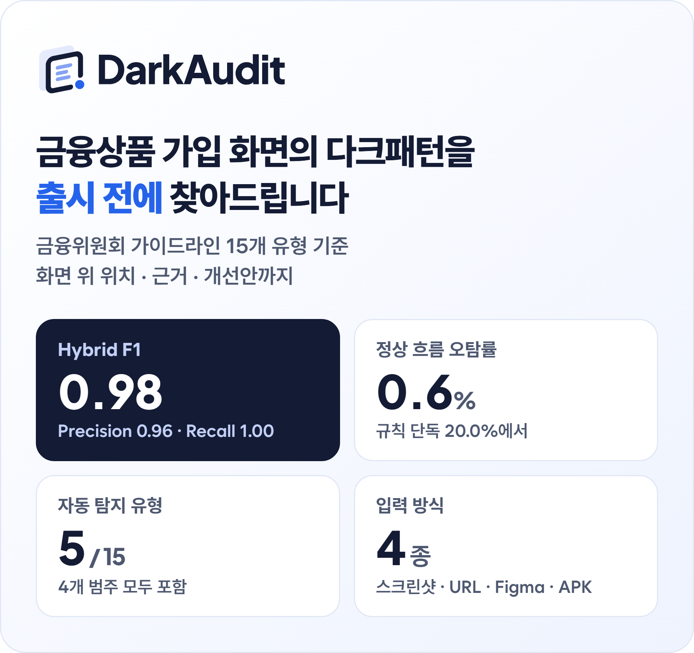

  

  로그인 없이 바로 사용할 수 있고, 준비된 데모 진단 결과를 바로 볼 수 있습니다 · <a href="https://dark-audit-seven.vercel.app/app/overview?audit=audit-41&amp;version=1"><b>데모 결과 바로 보기</b></a>

  
  

  
  
  
  
  

| 지금의 문제 | DarkAudit의 해결 |
| --- | --- |
| 「온라인 금융상품 판매 관련 다크패턴 가이드라인」이 2026년 4월 시행. 4개 범주 15개 유형을 화면마다 확인해야 함 | 15개 유형을 규칙으로 정리하고, 그중 5개 유형을 자동으로 찾아 화면 위 위치·근거·개선안을 제시 |
| 여러 화면에 걸친 가입 흐름을 사람이 수작업으로 점검 | 스크린샷·URL·Figma·APK를 넣으면 흐름 전체를 한 번에 검사 |
| 화면을 고칠 때마다 처음부터 다시 검토 | 같은 진단에 수정본을 올리면 해결·유지·신규·재발을 자동으로 비교 |

> [!NOTE]
> DarkAudit은 법령 위반을 판정하지 않습니다. 금융위원회 「온라인 금융상품 판매 관련 다크패턴 가이드라인」 기준으로 **담당자가 검토해야 할 위험**을 출시 전에 찾아줍니다.

 

## 🔍 실제 화면

  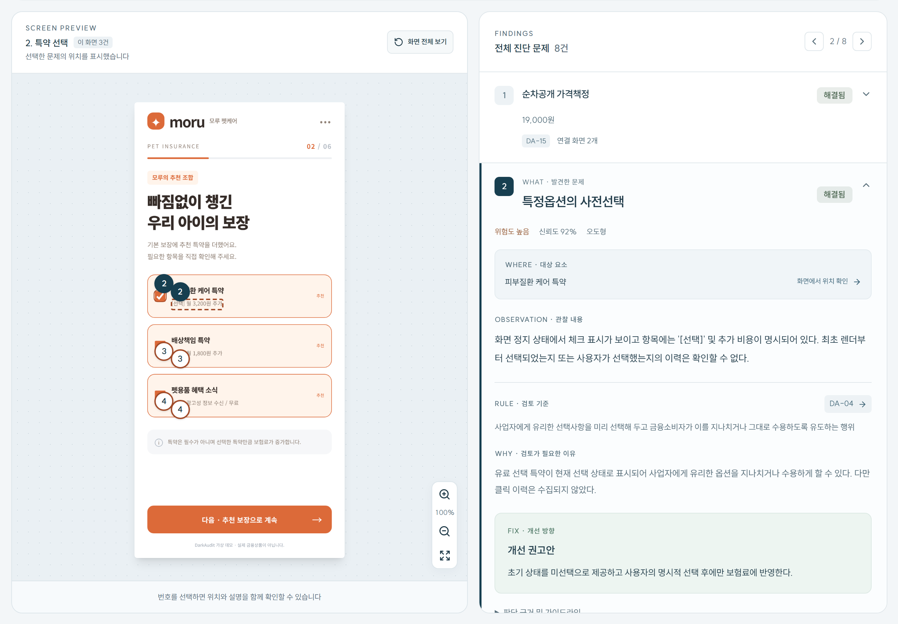

<table>
<tr>
<td width="50%">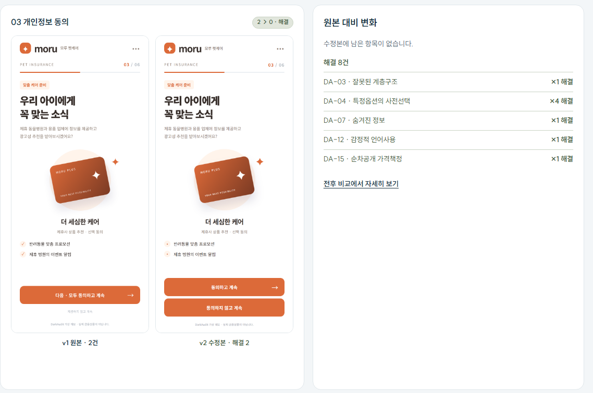</td>
<td width="50%">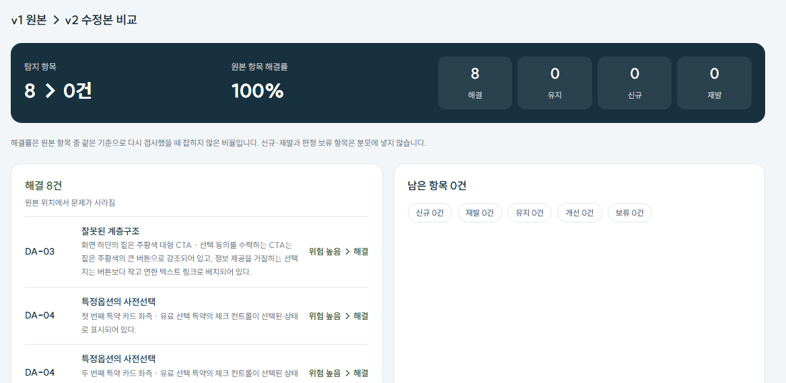</td>
</tr>
<tr>
<td align="center">원본 · 수정본 화면 비교</td>
<td align="center">수정 전후 자동 비교 요약</td>
</tr>
</table>

**펫케어 보험 데모 전후 비교: 8건 중 8건 해결 (100%)** 
출처 · 배포 서버 진단 audit-37, [`docs/eval/pet-recheck-2026-10-07.json`](docs/eval/pet-recheck-2026-10-07.json) 1회차

<b>회차별 결과</b>

| 회차 | 원본 탐지 | 수정본 탐지 | 해결 | 유지 | 해결률 |
| :-- | --: | --: | --: | --: | --: |
| 1회차 | 8 | 0 | 8 | 0 | 100% |
| 2회차 | 7 | 1 | 6 | 1 (화면 05 · DA-07) | 85.7% |

2026-10-07 로컬 실행 · `gpt-5.6-luna` · Tesseract OCR. 원자료: [`docs/eval/pet-recheck-2026-10-07.json`](docs/eval/pet-recheck-2026-10-07.json)

 

## 🧑‍💻 사용 방법

> [!TIP]
> 처음이라면 **새 진단 → 입력 유형별 데모 체험**에서 준비된 예시로 원본 검사 → 수정본 검사 → 전후 비교를 먼저 둘러보세요.

### STEP 1 · 새 진단 만들기

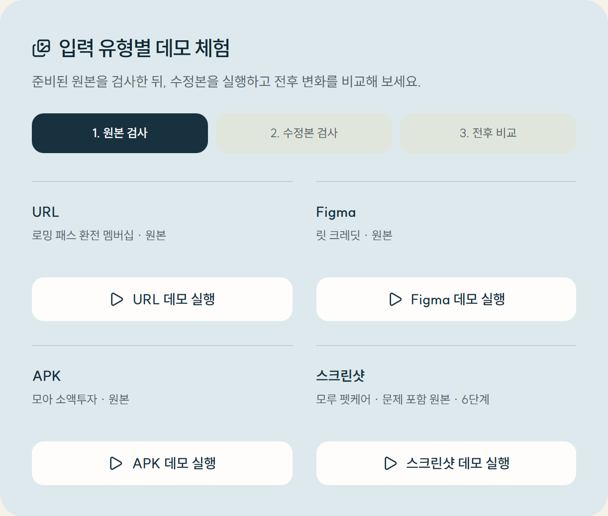

1. 처음이라면 **입력 유형별 데모 체험**으로 원본 검사 → 수정본 검사 → 전후 비교를 먼저 둘러보세요

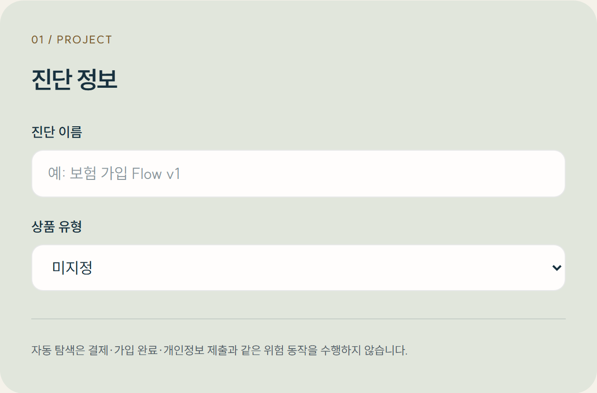

2. **진단 이름**과 **상품 유형**을 입력합니다 (예: 반려동물 보험 가입 화면 1차)

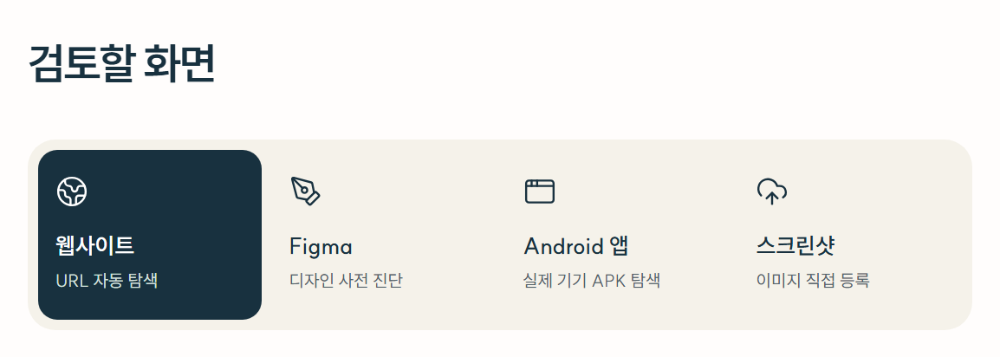

3. 입력 방식을 고릅니다 · **웹사이트 · Figma · Android 앱 · 스크린샷**

### STEP 2 · 화면 등록하고 분석 시작

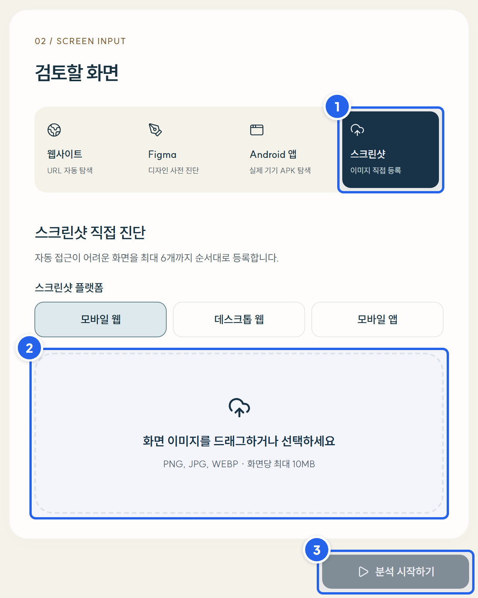

1. 스크린샷으로 점검할 때는 **스크린샷**을 선택합니다
2. 가입 순서대로 **1~6장** 등록 · PNG·JPG·WEBP, 장당 10MB 이하 · 등록 후에는 순서를 바꿀 수 없어요
3. **분석 시작하기**를 누르면 진행 화면에서 수집·분석 상태를 볼 수 있습니다

<b>입력 방식별 준비물</b>

| 입력 | 이럴 때 | 준비할 것 |
| :-- | :-- | :-- |
| 🖼️ 스크린샷 | 로그인 뒤 화면, 직접 캡처한 가입 과정 | PNG·JPG·WEBP 1~6장, 장당 10MB 이하, 가입 순서대로 |
| 🌐 웹사이트 | 공개된 상품 페이지·웹 가입 과정 | 공개 URL · 빠른 캡처 또는 스마트 탐색(AI가 클릭·스크롤) |
| 🎨 Figma | 개발 전 디자인 시안 | Figma 파일·영역 링크 · 프로토타입 Flow 또는 최상위 프레임 |
| 📱 Android 앱 | 설치 파일로 받은 앱 | 100MB 이하 APK (iOS 미지원) |

자동 탐색은 로그인·결제·가입 제출을 대신하지 않습니다. 필요한 단계가 빠졌다면 해당 화면을 캡처해 스크린샷으로 등록하세요.

### STEP 3 · 결과 요약 보기

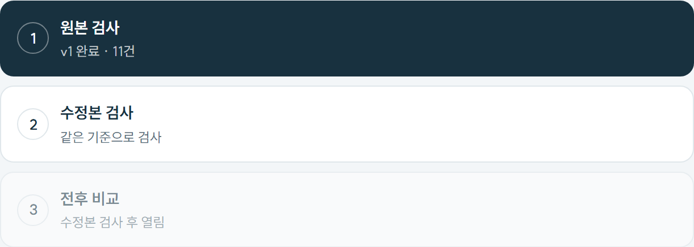

1. **원본 검사 → 수정본 검사 → 전후 비교** 순서로 진행 단계가 표시됩니다

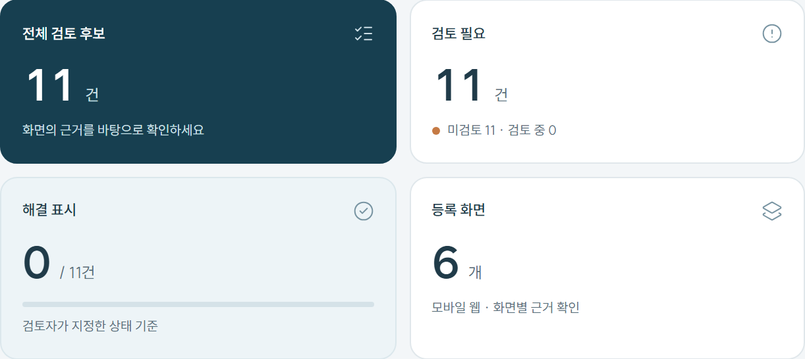

2. 검토 후보 · 검토 필요 · 해결 표시 · 등록 화면 수를 한눈에 확인

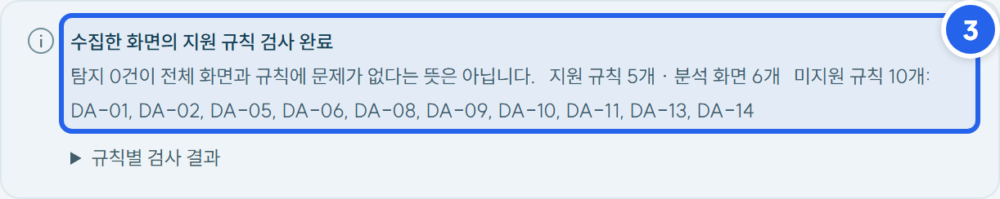

3. **검사 범위와 추가 확인 사항**을 먼저 읽으세요 · 미지원 규칙과 근거 부족 항목이 여기 나옵니다
4. 화면 흐름에서 화면을 고르면 그 화면의 후보만 볼 수 있습니다

### STEP 4 · 화면 근거 확인하고 검토 기록 남기기

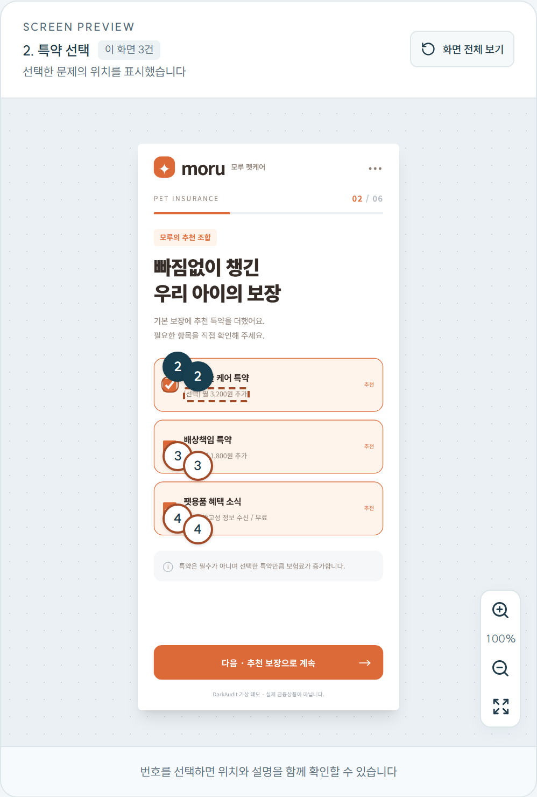

1. 항목을 고르면 **화면 위 위치**가 강조됩니다

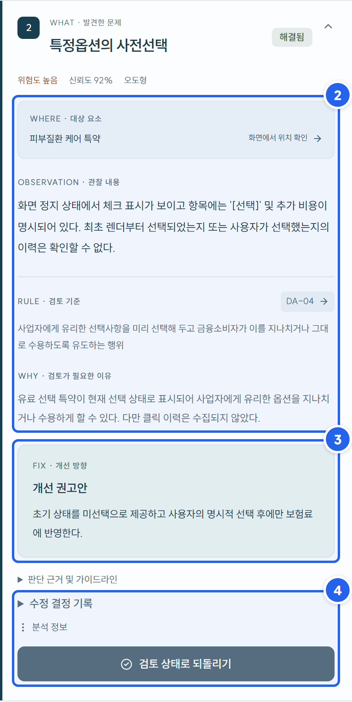

2. **WHERE · OBSERVATION · RULE · WHY** · 어디서 무엇을 보고 어떤 기준으로 판단했는지
3. **FIX** · 문구·선택 상태·정보 공개 방식을 어떻게 바꿀지 개선 권고안
4. 처리 상태 **미검토 → 검토 중 → 해결됨**과 수정 결정 메모를 남깁니다

**규칙별 상태 읽는 법** · 탐지 0건이 곧 “문제 없음”은 아닙니다.

| 상태 | 의미 |
| :-- | :-- |
| 🔴 탐지 | 검토할 후보를 찾음 · 화면 근거와 설명 확인 |
| ⚪ 미탐지 | 제공한 화면에서 해당 유형을 찾지 못함 |
| 🟡 근거 부족 | 정보가 부족해 판정 못 함 · 화면 추가나 직접 확인 필요 |
| ⚫ 미지원 | 현재 자동 탐지 범위 밖 |

### STEP 5 · 수정본 재검사

1. 결과 화면에서 **수정본 검사** 탭을 엽니다

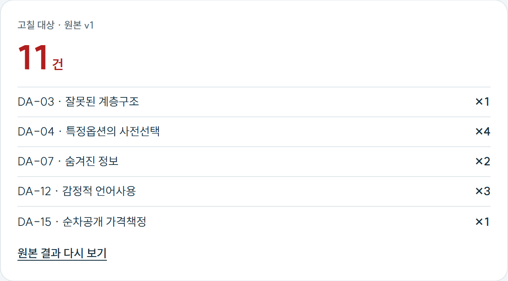

2. 원본에서 찾은 항목이 유형별로 정리되어 있습니다

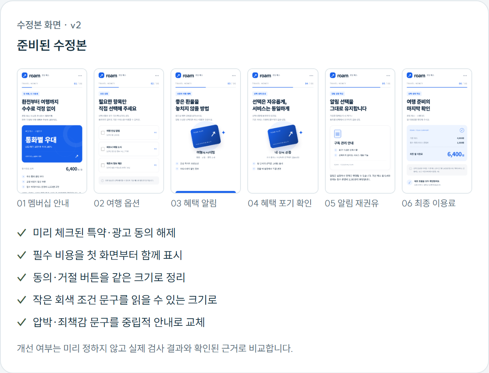

3. 같은 순서·단계명으로 **수정본 화면**을 등록합니다

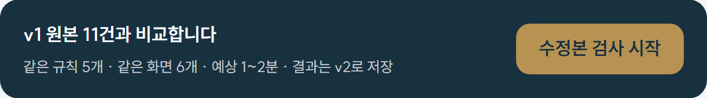

4. **수정본 검사 시작** → 같은 진단에 새 회차로 저장되고, **전후 비교**에서 결과를 봅니다

**전후 비교 결과 읽는 법**

| 결과 | 의미 |
| :-- | :-- |
| ✅ 해결 | 같은 검사 범위에서 더 이상 탐지되지 않음 |
| 🔁 유지 | 같은 항목이 다시 탐지됨 |
| ↘️ 개선 | 남아 있지만 위험도가 낮아짐 |
| 🆕 신규 | 이번 회차에 새로 탐지됨 |
| ⚠️ 재발 | 해결했던 항목이 다시 나타남 |
| ⏸️ 보류 | 보이지 않지만 해결을 확인할 근거가 부족함 · 해결률 계산에서 제외 |

> [!IMPORTANT]
> 재검사는 **기존 진단의 수정본 검사**에서 해야 다음 회차로 연결됩니다. 새 진단을 만들면 전후 비교가 되지 않습니다.

### STEP 6 · PDF 보고서로 공유

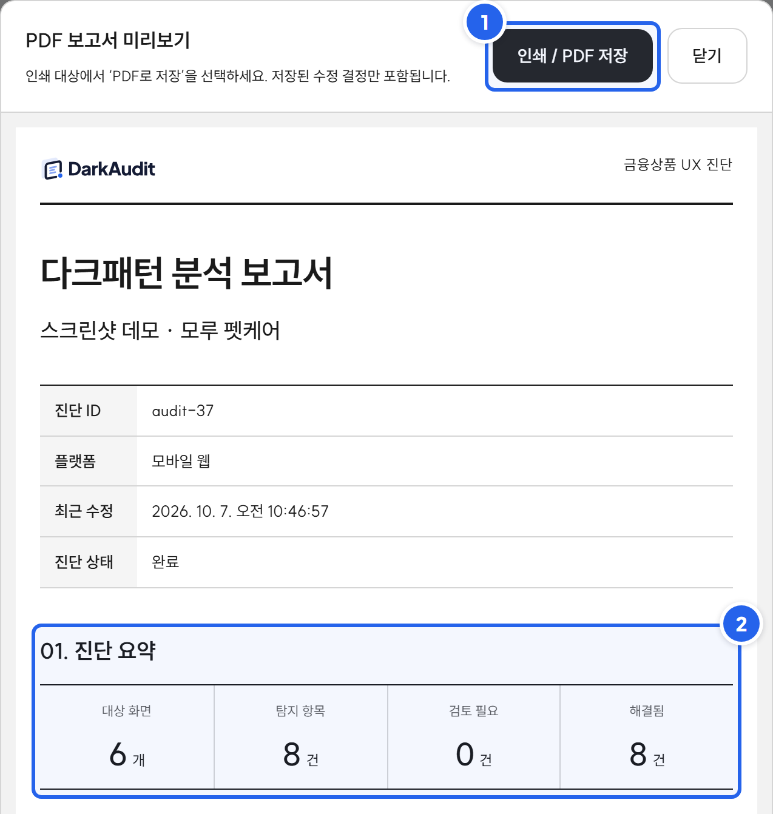

1. **PDF 보고서 출력 → 인쇄 / PDF 저장** · 인쇄 대상에서 ‘PDF로 저장’을 고릅니다
2. 진단 요약 · 대상 화면 · 탐지 · 검토 필요 · 해결 건수

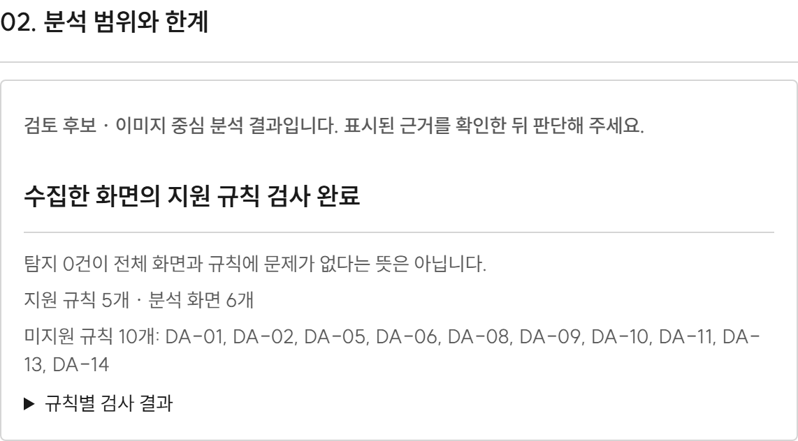

3. 분석 범위와 한계, 화면별 근거, 저장된 수정 결정까지 함께 담깁니다

그 밖에 **검토 기준** 메뉴에서 15개 유형의 설명과 확인할 점을, 오른쪽 아래 **다크패턴 챗봇**에서 유형별 질문 답변을 볼 수 있습니다. 모든 방문자가 같은 공용 작업공간을 사용하니 민감한 화면은 올리지 마세요. 자세한 안내: [docs/user-guide.md](docs/user-guide.md)

 

## ⚙️ 동작 방식

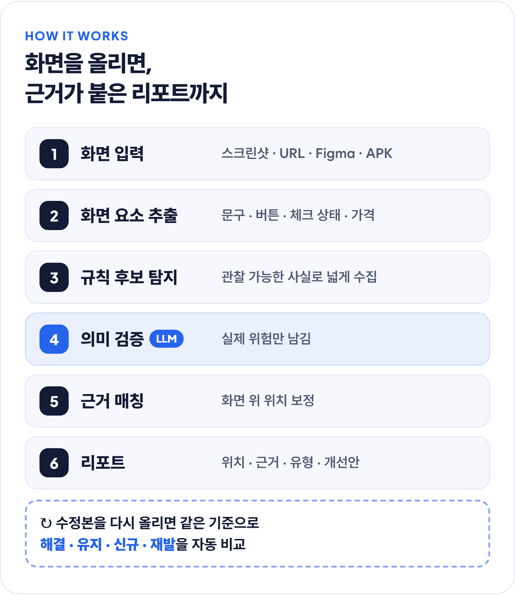

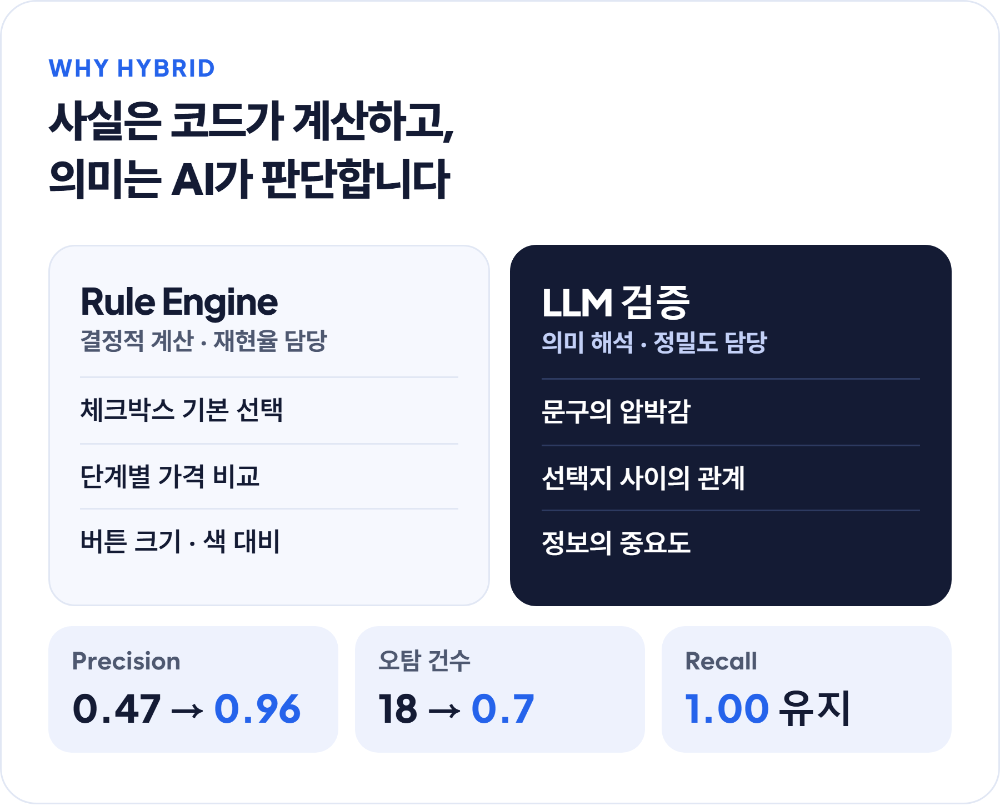

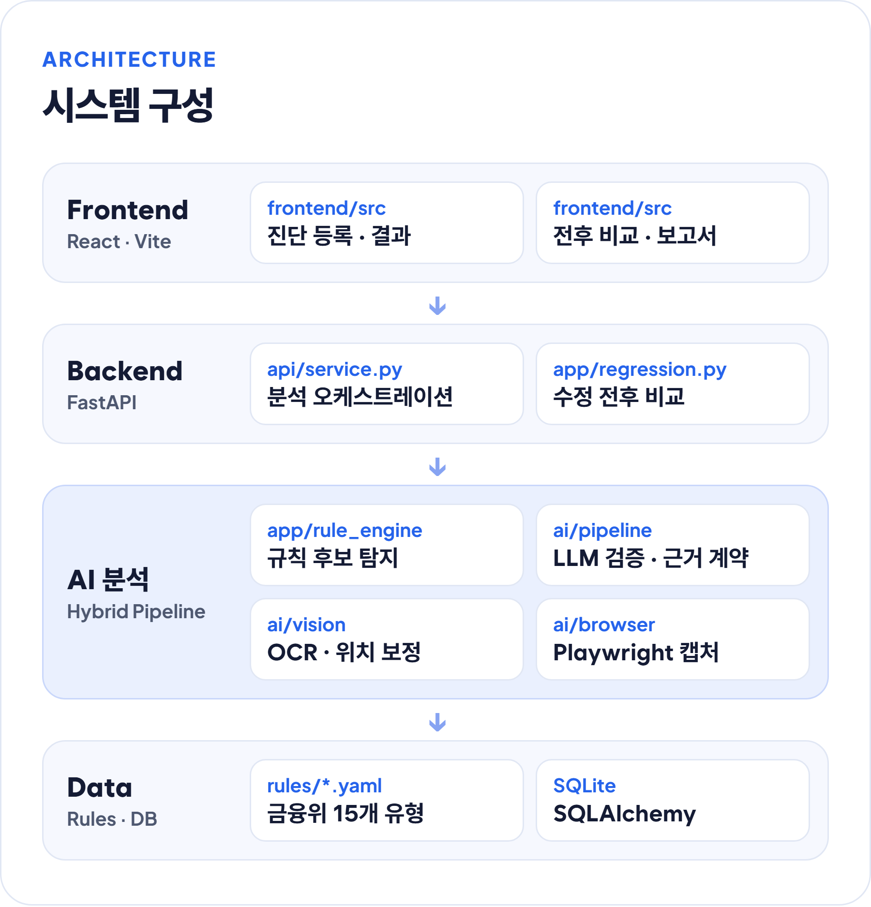

 

## 📊 성능

`gpt-5.6-luna` · 합성 보험·예적금 가입 흐름 22개(정상·문제 11쌍) · 110화면 · 3회 평균 · 2026-10-02

| 구성 | Precision | Recall | F1 | 정상 흐름 오탐률 |
| :-- | --: | --: | --: | --: |
| Rule Engine 단독 | 0.47 | 1.00 | 0.64 | 20.0% |
| **Hybrid (규칙 후보 + LLM)** | **0.96** | **1.00** | **0.98** | **0.6%** |

<b>유형별 성능과 측정 조건</b>

| 유형 | Hybrid Precision | Hybrid Recall |
| --- | ---: | ---: |
| DA-03 잘못된 계층구조 | 0.87 | 1.00 |
| DA-04 특정옵션의 사전선택 | 1.00 | 1.00 |
| DA-07 숨겨진 정보 | 1.00 | 1.00 |
| DA-12 감정적 언어사용 | 1.00 | 1.00 |
| DA-15 순차공개 가격책정 | 1.00 | 1.00 |

- 정답은 생성기가 심은 패턴 기준인 개발용 합성 데이터입니다. 이미지 분석 경로(LLM 단독)는 F1 0.46으로, 결과를 검토 후보로 읽어야 합니다.
- Hybrid가 모든 규칙을 판정하는 것은 아닙니다. 근거가 부족한 규칙은 결과에 ‘근거 부족’으로 표시합니다.

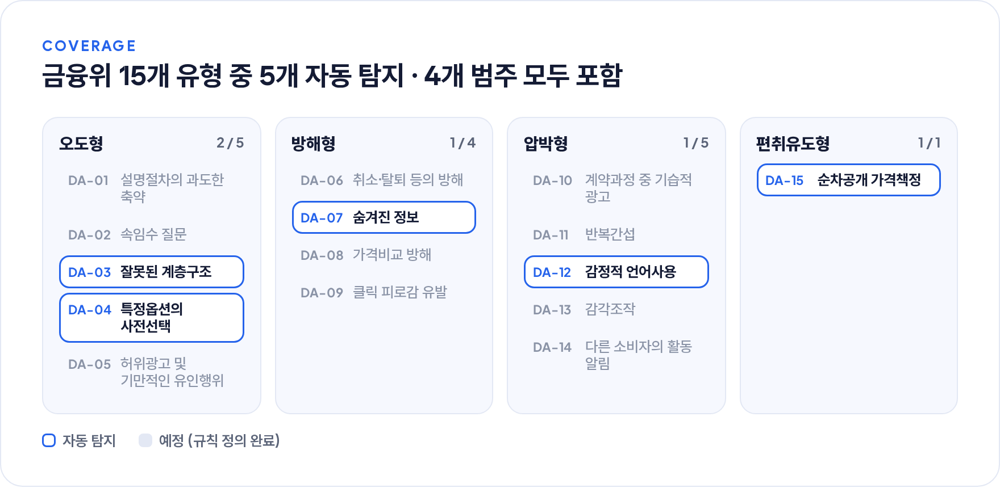

 

## 🧭 심사 포인트별 코드 위치

| 보고 싶은 것 | 위치 | 한 줄 설명 |
| :-- | :-- | :-- |
| 📜 금융위 15개 유형 규칙 정의 | [`rules/dark_pattern_rules.yaml`](rules/dark_pattern_rules.yaml) | 유형별 정의·관찰 특징·결정적/의미 검사·완화 조건 |
| ⚖️ Rule Engine 판정 로직 | [`backend/app/rule_engine/checks.py`](backend/app/rule_engine/checks.py) | 체크 상태·글자 크기·색 대비·단계별 가격 비교 |
| 🤖 LLM 검증 프롬프트 | [`ai/prompts/`](ai/prompts/) | `system.md`, `audit_v1.md`, 입력별 `dom.md`·`visual.md` |
| 📐 LLM 출력 스키마·근거 계약 | [`ai/schemas/audit_schema.py`](ai/schemas/audit_schema.py) · [`ai/pipeline/assessment_contract.py`](ai/pipeline/assessment_contract.py) | 지원 규칙, 규칙별 검사 결과 필수, 근거 계약 |
| 🔗 Hybrid 파이프라인 | [`ai/pipeline/baseline.py`](ai/pipeline/baseline.py) | OCR → 후보 → LLM → 정제 → 위치 보정 |
| 📍 근거 매칭·위치 보정 | [`ai/vision/text_grounding.py`](ai/vision/text_grounding.py) · [`ai/vision/candidate_grounding.py`](ai/vision/candidate_grounding.py) | OCR 문구 퍼지 매칭, 화면 후보 선택 |
| 🔁 수정 전후 재검증 | [`backend/app/regression.py`](backend/app/regression.py) · [`backend/app/fingerprint.py`](backend/app/fingerprint.py) | fingerprint로 항목을 맞춰 해결·유지·신규·재발·보류 판정 |
| 🧪 평가 스크립트 | [`backend/eval_hybrid.py`](backend/eval_hybrid.py) · [`ai/evaluation/`](ai/evaluation/) | 합성 데이터 분석 실행과 탐지·비교·설명·RAG 채점 |
| ✅ 테스트 | [`ai/tests/`](ai/tests/) · [`backend/tests/`](backend/tests/) · [`frontend/e2e/`](frontend/e2e/) | 단위·API·E2E·접근성·시각 회귀 |
| 🛡️ 보안 정책 | [`ai/browser/safety.py`](ai/browser/safety.py) · [`backend/api/access.py`](backend/api/access.py) | 브라우저 동작·주소 차단, 서명된 이미지 URL |

 

## 🛡️ 신뢰성과 보안

| | |
| :-- | :-- |
| **테스트** | AI 160 · 백엔드 168 · 프런트 Vitest 101 · Playwright E2E 84 |
| **키 없이 테스트** | 백엔드는 `DARKAUDIT_PROVIDER=fake`와 임시 DB, E2E는 목업 API(MSW) |
| **API 키 관리** | `.env`에만 보관, Git 제외 · 저장소에는 변수명만 있는 `.env.example` |
| **자동 탐색 안전장치** | 입력·제출·결제·가입·동의 클릭, 사설망·교차 출처 이동, 다운로드, 팝업 차단 |
| **결정적 계산과 AI 판단 분리** | 체크 상태·가격 같은 사실은 Rule Engine이 계산하고, LLM은 후보의 의미만 판정. 근거가 부족한 판정은 ‘근거 부족’으로 표시 |
| **보수적 판정** | 근거가 부족하면 ‘근거 부족’ · 재검증에서 ‘해결’ 대신 ‘보류’ |

 

## 🚧 한계와 다음 단계

- 자동 탐지는 15개 유형 중 **5개**입니다. 이미지 입력 결과는 검토 후보로 봐야 합니다.
- 평가는 **합성 데이터** 기준이며, 실제 금융 서비스 데이터와 업무 효과는 아직 측정 전입니다.
- 스마트 탐색은 안전 제한 때문에 가입 흐름 전체 수집을 보장하지 않습니다.
- **다음** → 나머지 10개 유형 확대 · Figma 연동 고도화(사용자별 OAuth) · 로그인·마스킹 등 데이터 보호

 

## 👥 팀 소금빵

| 이름 | 역할 | 담당 |
| :-- | :-- | :-- |
| 배소연 | 팀장 · AI Engineer | 멀티모달 분석, 입력 파이프라인, 근거 검증, 평가, 프런트엔드 |
| 이정현 | Data Engineer | 룰 엔진, 규제 데이터 파이프라인, 백엔드, 배포 |

 

  참고 · 금융위원회·금융감독원 <a href="https://www.fsc.go.kr/po010106/85942">「온라인 금융상품 판매 관련 다크패턴 가이드라인」 마련</a> (2025.12.26) 
  <a href="docs/user-guide.md">사용 안내</a> · <a href="docs/evaluation.md">평가</a> · <a href="docs/feature-spec.md">기능 명세</a> · <a href="docs/DEVELOPMENT.md">개발 안내</a> · <a href="LICENSE">MIT License</a>

