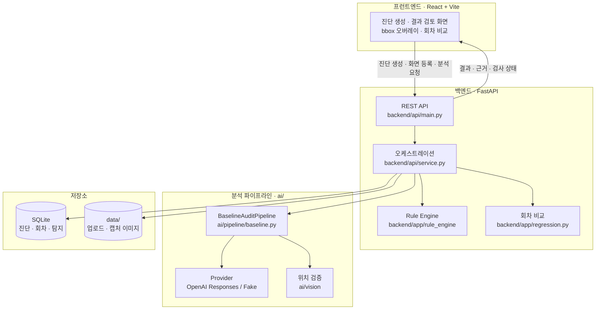
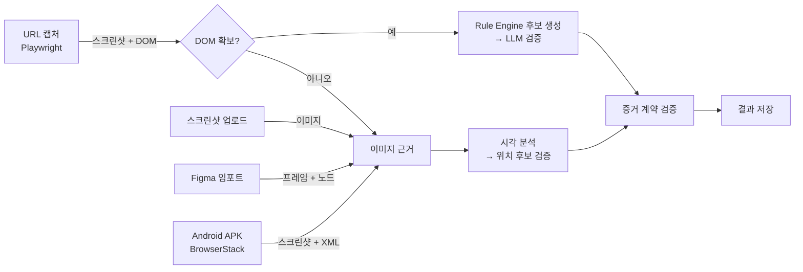
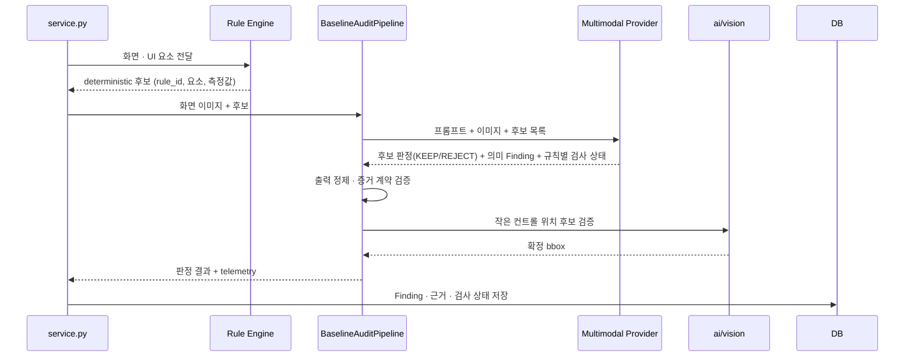
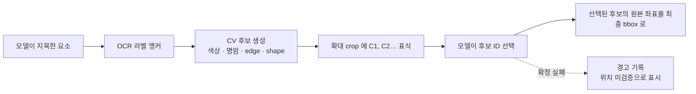
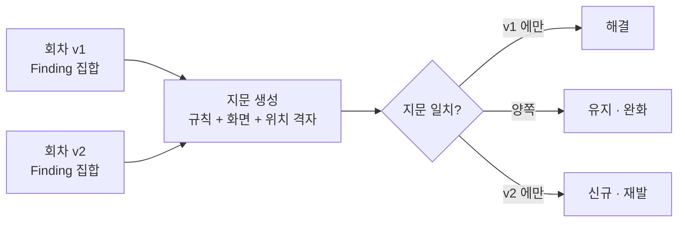
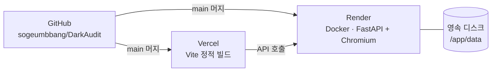

# 시스템 구성도

> **초안입니다.** 멀티모달 분석(`ai/pipeline`, `ai/vision`, `ai/providers`) 부분은 뼈대만
> 그렸습니다. 실제 판단 단계와 프롬프트 구성은 담당자가 보강해 주세요. 보강이 필요한
> 지점은 각 절 끝에 `TODO`로 남겨 두었습니다.

## 1. 전체 구성

## 2. 입력 경로

입력마다 확보할 수 있는 근거가 다르고, 그에 따라 Rule Engine의 관여 범위가 달라집니다.

| 입력 | 화면 확보 | Rule Engine | LLM이 새로 만들 수 있는 Finding |
| --- | --- | --- | --- |
| URL (DOM 확보) | Playwright 캡처 + DOM 추출 | 후보 생성 | 의미 판단 규칙만 (`DA-03`, `DA-12`) |
| URL (DOM 실패) · 스크린샷 · Figma · APK | 이미지 + OCR / 노드 / XML | 후보 없음 | MVP 5개 규칙 |

## 3. 분석 파이프라인

### 출력 정제 단계

모델 출력은 신뢰하지 않고 계약에 맞게 정제합니다. 계약 위반 하나로 진단 전체가 실패하지
않도록, 스키마 불변식은 유지한 채 파서에서 손질합니다 (`ai/pipeline/response_parser.py`).

| 처리 | 이유 |
| --- | --- |
| 허용되지 않은 규칙의 의미 Finding 제거 | URL 경로는 deterministic 규칙을 후보로만 다룬다 |
| `severity` · `risk_name` 을 Rule Base 값으로 교정 | 조회표 값이라 모델 답변에 정보가 없다 |
| 단일 화면 규칙의 화면 목록 축소 | `DA-15` 를 뺀 규칙은 정의상 한 화면에서 판정한다 |

정제한 항목은 경고 로그와 `last_run_telemetry`에 남겨 모델이 계속 계약을 어기는지 추적합니다.

> **TODO (멀티모달 담당)**
> - 프롬프트 구성: 시스템 프롬프트 · 규칙 설명 · 후보 제시 방식을 어떤 순서로 넣는지
> - 판정 기준: KEEP/REJECT 를 가르는 근거 요건 (`ai/pipeline/assessment_contract.py`)
> - 재시도 전략: 스키마 실패와 증거 계약 실패를 어떻게 다르게 다루는지
> - `ai/vision` 의 후보 생성 채널(OCR · 색상 · 명암 · edge · shape)과 선택 방식

## 4. 근거 위치 확정

작은 컨트롤은 모델이 준 좌표를 그대로 쓰지 않고 별도로 검증합니다.

> **TODO (멀티모달 담당)** — 후보 생성 채널별 가중치, 실패 시 대체 경로, OCR 미설치 환경의
> 동작을 보강해 주세요.

## 5. 회차 비교 (Before/After)

지문에는 모델이 쓴 서술을 넣지 않습니다. 같은 화면을 다시 분석해도 표현이 달라져, 고친 것이
없는데 "해결 + 신규"로 잡히기 때문입니다. DOM 텍스트가 있으면 그것을 쓰고, 없으면 위치로
식별합니다 (`backend/app/fingerprint.py`).

## 6. 배포

절차와 환경 변수는 [배포 가이드](deploy.md)에 있습니다.

## 관련 문서

- [탐지 성능과 평가 방법](../README.md#탐지-성능)
- [규칙 정의](../rules/dark_pattern_rules.yaml) · [라벨링 가이드](labeling_guide.md)
- [분석 경로 결함 수정 기록](analysis_fixes_2026-09-06.md)
