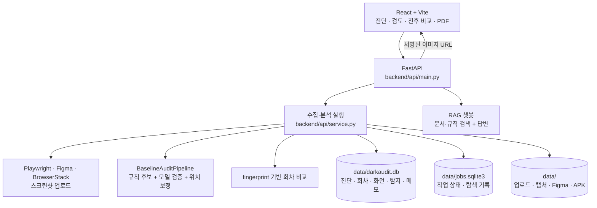
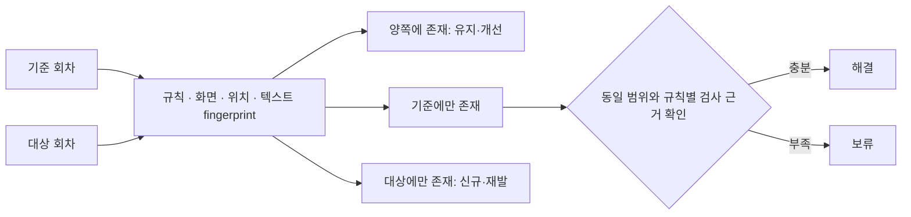

# 시스템 구성도

> 현재 구현 기준 · 2026-10-08 · 기준 커밋 `5748f51`

DarkAudit은 화면 수집, 규칙 후보 생성, 모델 검증, 근거 위치 보정, 회차 비교를 분리한다. 자동 탐지 범위는 DA-03·04·07·12·15이며 전체 15개 유형의 정의는 [Rule Base](../rules/dark_pattern_rules.yaml)에 있다.

## 1. 전체 구성

```mermaid
flowchart TB
    UI["React + Vite<br/>진단 · 검토 · 전후 비교 · PDF"]
    API["FastAPI<br/>backend/api/main.py"]
    SVC["수집·분석 실행<br/>backend/api/service.py"]
    INPUT["Playwright · Figma · BrowserStack<br/>스크린샷 업로드"]
    PIPE["BaselineAuditPipeline<br/>규칙 후보 + 모델 검증 + 위치 보정"]
    REG["fingerprint 기반 회차 비교"]
    CHAT["RAG 챗봇<br/>문서·규칙 검색 + 답변"]
    DB[("data/darkaudit.db<br/>진단 · 회차 · 화면 · 탐지 · 메모")]
    JOB[("data/jobs.sqlite3<br/>작업 상태 · 탐색 기록")]
    FS[("data/<br/>업로드 · 캡처 · Figma · APK")]
    UI --> API
    API --> SVC
    API --> CHAT
    SVC --> INPUT
    SVC --> PIPE
    SVC --> REG
    SVC --> DB
    SVC --> JOB
    SVC --> FS
    API -->|"서명된 이미지 URL"| UI
```

작업은 FastAPI `BackgroundTasks`로 실행한다. 작업 기록은 SQLite에 보존하지만 실행 자체를 재개하는 외부 작업 큐는 없다. 수집·분석의 무거운 구간은 프로세스 내 잠금으로 직렬화하며 단일 Uvicorn 프로세스를 전제로 한다.

## 2. 입력과 분석 경로

| 입력 | 수집 근거 | 규칙 후보와 의미 분석 |
| --- | --- | --- |
| URL, DOM 확보 | Playwright 이미지·DOM 텍스트·선택 상태·스타일 | Rule Engine 후보를 모델이 KEEP/REJECT. 새 의미 Finding은 DA-03·DA-12 |
| URL, DOM 미확보 | 이미지·OCR | 이미지 분석으로 전환, 지원 5규칙의 의미 Finding 허용 |
| 스크린샷 | 업로드 이미지·OCR | 지원 5규칙의 이미지 분석 |
| Figma | 프레임 PNG·노드 텍스트·위치·프로토타입 경로 | 이미지 분석. 노드 근거는 모델 입력에 사용 |
| Android APK | BrowserStack 스크린샷·접근성 XML | 이미지 분석. XML 근거는 모델 입력에 사용 |

웹 업로드·이미지 CLI·모델 요청은 1~6장을 받는다. URL이나 Figma의 더 긴 경로는 프로필·경로별로 묶어 최대 6장씩 문맥을 중첩해 분석한다. 분할된 흐름에서는 모든 먼 단계의 가격 비교를 보장하지 않아 `long_flow_comparison_limited`를 기록한다. URL 전체 페이지 원본은 읽기 좋은 조각으로 분석한 뒤에도 검토용으로 보존하며, 분석에서 제외한 원본은 검사 화면 수에 중복 산입하지 않는다.

근거: [입력 계약](../ai/schemas/audit_schema.py), [URL·배치 처리](../ai/pipeline/web_audit.py), [분석 서비스](../backend/api/service.py).

## 3. 모델 요청과 출력 검증

1. DOM·Figma·XML 근거가 없는 화면에 OCR 텍스트와 위치를 보충한다. OCR이 없으면 분석은 계속하되 근거 부족 경고를 남긴다.
2. `system.md`, 공통 `audit_v1.md`, 입력별 `dom.md` 또는 `visual.md`를 사용한다. 지원 5규칙, 후보 ID·측정값, 화면 ID·순서·이미지·근거를 함께 전달한다.
3. 모델은 후보 판정, 허용된 의미 Finding, 지원 규칙별 검사 결과를 구조화 응답으로 반환한다.
4. 파서는 잘못된 규칙명·등급·화면 참조를 정제하고 증거 계약을 검증한다. DA-03의 선택지 관계, DA-15의 동일 상품·조건과 공개 순서 등을 확인한다.
5. 기본 최대 2회 생성한다. 첫 검증 실패는 오류를 프롬프트에 추가해 다시 요청한다. 마지막 시도의 복구 가능한 증거 계약 오류는 해당 규칙을 분리해 근거 부족으로 남기며, 복구할 수 없는 출력은 작업 실패가 된다.
6. 신뢰도 필터와 중복 제거, 위치 보정을 거쳐 결과와 telemetry를 저장한다. 의미 Finding의 신뢰도 기준은 0.70이다.

`fake` provider는 새 의미 Finding을 생성하지 않고 전달받은 결정적 후보를 KEEP한다. 따라서 후보 없는 이미지 분석은 0건이지만 DOM 후보가 있는 모의 분석은 결과가 나올 수 있다. 어느 경우든 실모델 평가가 아니며 `mock_analysis` 한계를 표시한다.

근거: [프롬프트](../ai/prompts/), [파이프라인](../ai/pipeline/baseline.py), [응답 파서](../ai/pipeline/response_parser.py), [증거 계약](../ai/pipeline/assessment_contract.py), [규칙별 복구](../ai/pipeline/evidence_recovery.py).

## 4. 근거 위치 보정

| 대상 | 처리 | 확정하지 못한 경우 |
| --- | --- | --- |
| DA-03 CTA·DA-04 컨트롤 | OCR 라벨 주변에서 색상·명암·경계·형태 후보 생성. 거리·크기·형태로 정렬하고 확대 이미지의 후보 ID를 모델이 선택 | 약한 후보로 덮어쓰지 않고 기존 bbox와 경고 유지 |
| DA-03 관계 요소 | 대립 선택지의 텍스트·컨트롤 위치를 함께 보정 | 항목별 telemetry에 결과 기록 |
| DA-07·DA-12 텍스트 | 인용 문구와 OCR 줄을 퍼지 매칭하고 문단을 확장. 필요하면 문단 후보 선택 | 모델 bbox를 대체 경로로 사용 |
| DOM 후보 | 수집한 요소·관계 요소의 좌표 사용 | DOM 미확보 시 이미지 경로로 전환 |

컨트롤 보정은 신뢰도 0.5 이상이고 원래 좌표와 달라질 때 적용한다. 최종 위치와 판정의 정확성은 서로 다른 품질이다. UI에는 위치 검증 여부를 나타내는 개별 배지가 없으며 적용 여부·후보 출처·경고는 `bbox_localizations`에 기록한다.

근거: [후보 위치 보정](../ai/vision/candidate_grounding.py), [텍스트 위치 보정](../ai/vision/text_grounding.py).

## 5. 결과 저장과 작업 복구

`Audit → AuditRun → Screen/Element/Finding/Evidence`에 분석 결과를 저장한다. Finding의 사용자 검토 상태(`status`)와 자동 비교 판정(`comparison_status`)은 별도 컬럼이다. 수정 결정 메모와 수정 시각도 보존한다.

대시보드는 최근 수정 순으로 진단을 반환한다. 최신 회차가 진행 중이거나 실패했어도 가장 최근 완료 회차의 결과를 열 수 있다. `GET /api/v1/audits/{audit_id}/runs/{version}`은 특정 완료 회차를 반환한다.

작업 진행률·오류·탐색 이벤트는 `data/jobs.sqlite3`에 저장한다. 서버 재시작 시 진행 중 작업과 회차를 실패로 정리하고 기존 작업 URL에서 중단 이유와 수집 기록을 확인하게 한다. 자동 재개는 하지 않는다. 같은 회차의 실행 중·완료 작업 중복 등록과 진행 중 진단의 삭제를 차단한다.

근거: [DB 모델](../backend/app/models.py), [DTO 변환](../backend/api/store.py), [작업 기록](../backend/api/jobs.py).

## 6. 수정 전후 비교

```mermaid
flowchart LR
    A["기준 회차"] --> FP["규칙 · 화면 · 위치 · 텍스트 fingerprint"]
    B["대상 회차"] --> FP
    FP --> BOTH["양쪽에 존재: 유지·개선"]
    FP --> OLD["기준에만 존재"]
    FP --> NEW["대상에만 존재: 신규·재발"]
    OLD --> CHECK{"동일 범위와 규칙별 검사 근거 확인"}
    CHECK -->|충분| RES["해결"]
    CHECK -->|부족| PENDING["보류"]
```

조회 API와 비교 화면은 기본으로 **최초 완료 회차와 최신 완료 회차**를 비교하고 사용자가 기준·대상 회차를 선택할 수 있다. 결과 화면에서 원본·수정본을 다시 열고 전후 이미지를 비교하며 비교 PDF도 출력한다. 분석 완료 시 저장하는 자동 비교 이력은 **직전 완료 회차**를 기준으로 한다.

화면 수·순서·단계·프로필·경로 또는 지원 규칙이 다르면 해결 확인을 보류한다. 같은 범위에서 특정 규칙만 근거가 부족하면 전체 배치의 검사 기록이 유효한 다른 규칙은 따로 해결 판정할 수 있다. 긴 흐름 분할은 DA-15 비교를 제한한다. 조회는 DB 상태를 변경하지 않는다.

해결률은 `resolved / (resolved + persisted + improved)`이다. 보류·신규·재발은 분모에서 제외한다. 제약이 있고 재검증한 항목이 없으면 `null`을 반환하며 화면에서 산출 보류로 표시한다. 재발 이력에는 자동 해결 기록과 사용자가 지정한 해결 상태가 모두 사용될 수 있다.

근거: [비교 엔진](../backend/app/regression.py), [fingerprint](../backend/app/fingerprint.py), [비교 화면](../frontend/src/pages/support/BenchmarkPage.tsx).

## 7. 공용 작업공간과 파일 접근

모든 방문자가 같은 진단 목록과 결과를 사용하는 공용 작업공간이다. 사용자별 로그인·소유권 격리는 없다. `/api/v1/sessions`는 이전 프런트와의 호환용이며 접근 권한을 나누지 않는다.

`/artifacts`는 `data/` 전체의 정적 마운트가 아니다. 허용된 이미지 경로에 대해 진단별 서명과 만료 시각을 검사한다. 서명은 다음 UTC 자정까지 유효하며 DB·APK·JSON과 서명 없는 요청은 제공하지 않는다. 공개 합성 데모 자산은 `/demo/`로 제공한다.

`PROTECTED_AUDIT_IDS`에 지정된 대표 진단만 화면·API 삭제를 막는다. 기본값은 비어 있으며 일반 데모도 보호 목록에 없으면 삭제할 수 있다. 보호 목록은 재검사·검토의 접근 권한 설정이 아니다.

근거: [이미지 접근](../backend/api/access.py), [삭제 보호](../backend/api/protection.py), [배포·관리 안내](deploy.md).

## 8. 챗봇과 배포

RAG 챗봇은 진단과 독립적으로 가이드라인 코퍼스와 규칙 YAML을 검색한다. 현재 진단·화면을 자동으로 읽지 않는다. 랜딩과 앱 화면에 위젯을 제공하며 [챗봇 문서](chatbot.md)에 설정과 평가 방법이 있다.

백엔드는 Docker·Render, 프런트는 Vite 정적 빌드·Vercel 구성이다. DB·작업 기록·이미지를 보존하려면 `/app/data` 영속 디스크가 필요하다. 저장소의 `render.yaml`에는 디스크 선언이 없다. 배포 설정과 확인 절차는 [배포 가이드](deploy.md)를 따른다.

## 관련 문서

- [문서 안내](README.md) · [기능 명세](feature-spec.md) · [개발 안내](DEVELOPMENT.md)
- [평가와 측정 조건](evaluation.md) · [라벨링 기준](labeling_guide.md)
