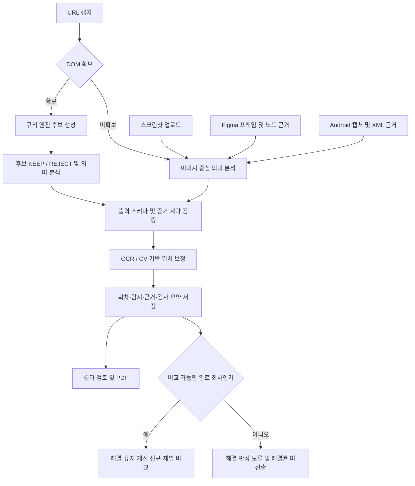

# DarkAudit 기능명세서

> 현재 구현 기준 · 2026-10-08 개정

## 1. 문서 기준과 적용 범위

| 항목 | 기준 |
| --- | --- |
| 대상 서비스 | 금융상품 화면의 다크패턴 검토 지원 서비스 DarkAudit |
| 기준 코드 | `5748f51`의 추적된 소스 코드. 이번 개정은 문서만 수정 |
| 이번 개정에 포함한 변경 | 6장 모델 입력, 원본 기준 회차 선택·전후 이미지·비교 PDF, 검토/비교 상태 분리, 작업 기록 영속화, 공용 작업공간과 이미지 서명, 대표 진단 삭제 보호, Figma 실제 인증 방식 |
| 작성 기준 | API·프론트·분석 파이프라인·평가 코드의 실제 동작. 기획상의 요구사항과 구현 여부를 구분 |
| 이전 문서 | Git 이력의 이 파일 이전 버전. 로컬 참고 PDF는 저장소에 포함하지 않음 |
| 배포 범위 | 로컬 저장소 기준. 운영 배포에 같은 변경이 반영됐는지는 확인하지 않음 |
| 검증 기록 | 기존 테스트 실행 기록과 현재 소스 확인을 구분. 이번 문서 개정에서 실모델 성능은 재측정하지 않음 |

**상태 표기**: `구현`은 명시한 범위에서 코드가 존재한다는 뜻이다. `부분`은 일부 동작·입력·화면만 지원한다는 뜻이며, `미구현`은 해당 업무 기능을 제공하지 않는다는 뜻이다. 외부 서비스의 운영 연동 성공이나 정확도 보장을 의미하지 않는다.

상세 설계나 기존 README와 충돌할 경우 이 문서의 기준 작업 트리에서 확인한 코드 동작을 우선한다. 웹 스크린샷 업로드·모델 요청·이미지 CLI의 상한은 모두 **6장**이다.

## 2. 서비스 목적과 사용자 흐름

### 2.1 목적

금융상품 가입·이용 화면에서 다크패턴에 해당할 수 있는 요소를 찾고, 위치·관찰 근거·관련 규칙·개선 권고를 제공한다. 사용자는 탐지 항목을 검토하고 수정 결정을 기록할 수 있다. 같은 진단에 새 회차를 등록하면 API에서 수정 전후 결과를 비교한다.

대상 사용자는 금융 서비스 기획자, 디자이너, QA 및 소비자보호 검토 담당자다. 탐지 결과는 검토를 지원하는 자료이며 법적 위반을 확정하는 판정이 아니다.

### 2.2 기본 사용 흐름

1. 랜딩 또는 대시보드에서 새 진단을 시작한다.
2. 진단명, 상품 유형, 입력 방식을 지정한다.
3. 스크린샷·URL·Figma·Android APK 중 한 경로로 화면을 등록한다.
4. 작업 상태를 조회하며 분석 완료 또는 실패를 확인한다.
5. 결과 상단의 검사 범위·근거 부족·검토 후보 안내를 확인한다.
6. 화면의 표시 영역과 탐지 목록을 함께 보며 수정 여부를 검토한다.
7. 처리 상태와 수정 결정 메모를 저장하거나 PDF 보고서를 출력한다.

**재진단 범위**: 결과 화면의 ‘수정본 재검사’에서 같은 Audit에 스크린샷 수정본을 등록할 수 있다. 기존 1~6개 화면의 순서·단계명을 유지하며 각 화면의 수정본을 모두 선택한다. 완료 후 ‘전후 비교 보기’는 기본으로 최초 완료 회차(원본)와 최신 완료 회차를 비교한다. 완료 회차 중 기준·대상을 선택하고, 결과 화면에서 원본·수정본 이미지 비교와 과거 회차 조회를 할 수 있다. 새 진단 폼은 별도의 Audit를 생성한다.

### 2.3 분석 경로



## 3. 화면 구성

| 경로 | 화면 | 현재 기능과 한계 |
| --- | --- | --- |
| `/`, `/landing` | 서비스 소개 | 서비스 설명, 입력 방식 소개, 검토 기준 안내, 새 진단 이동. 두 경로는 같은 랜딩 화면 |
| `/app` | 앱 진입 | `/app/dashboard`로 이동 |
| `/app/dashboard` | 대시보드 | 전체 진단, 검토 필요, 검토 완료, 탐지 항목 수 등 저장된 진단 기반 집계 |
| `/app/audits` | 진단 기록 | 진단 목록, 상태·화면·탐지 수 확인, 상세 이동, 삭제 확인 |
| `/app/audits/new` | 새 진단 | 상품 유형 및 입력 방식 선택, 데모 입력, 분석 진행률·오류 표시 |
| `/app/overview` | 결과 검토 | 진단 선택, 화면 순서 탐색, 위치 강조, 탐지 목록·상세, 필터, 상태·메모 저장, PDF |
| `/app/guidelines` | 검토 기준 | 4개 범주와 15개 유형 설명. 설명 제공 범위와 자동 탐지 범위는 다름 |
| `/app/benchmark` | 비교 분석 | 기준·대상 완료 회차 선택, 원본 대비 해결·유지·개선·신규·재발·보류, 해결률·비교 PDF |
| `/app/audits/:auditId/recheck` | 수정본 재검사 | 기존 단계별 스크린샷 교체, 새 회차 등록·분석 진행·실패 재시도·비교 이동 |
| `/app/settings` | 설정 안내 | 데모 운영 및 입력 안내. 서버 모델·인증·보관 정책을 수정하는 설정 폼은 없음 |

결과 페이지는 `audit` 쿼리로 진단을 지정할 수 있다. 미지정 시 대시보드 응답의 활성 진단을 사용한다. 화면·탐지 선택은 URL 쿼리와 연동한다. `version`으로 과거 완료 회차를 열고, 비교 화면의 `from`·`to`로 비교 범위를 지정한다.

근거: [라우터](../frontend/src/app/router.tsx), [결과 화면](../frontend/src/pages/overview/OverviewPage.tsx), [지원 화면](../frontend/src/pages/support/SupportPages.tsx), [대시보드 집계](../frontend/src/pages/dashboard/dashboard.ts).

## 4. 기능 목록

기존 명세서의 F-01~F-33 식별자를 유지하고, 별도 계약을 갖게 된 기능을 뒤에 추가했다.

| ID | 기능 | 상태 | 현재 범위 |
| --- | --- | --- | --- |
| F-01 | 순서 있는 스크린샷 업로드 | 구현 | 웹 1~6장, 이미지 검증·정규화, 단계명 지정 |
| F-02 | Figma 직접 임포트 | 구현 | REST API 프레임 렌더·노드 근거·프로토타입 경로, 서버 PAT 인증 |
| F-03 | URL 캡처·DOM 수집 | 구현 | quick/smart, desktop/mobile, 전체 페이지 분할 |
| F-04 | Android APK 수집 | 구현 | BrowserStack 기반 캡처·접근성 XML, 외부 계정 필요 |
| F-05 | 화면 순서 지정·변경 | 부분 | 업로드 순서·단계명 지원, 등록 후 재정렬 UI/API 없음 |
| F-06 | OCR·UI 요소 파싱 | 부분 | 한영 OCR, DOM/XML 요소 추출. 이미지의 일반 UI 유형 분류는 제한적 |
| F-07 | 요소 위치·상태·스타일 추출 | 부분 | 입력 경로별 확보 가능한 속성이 다름 |
| F-08 | 구조화된 UI 표현 | 부분 | 규칙 엔진 요소 모델과 분석 입력 계약 존재. 모든 입력의 동일한 구조화는 미완성 |
| F-09 | 15유형 규칙 데이터 | 구현 | YAML 정의·검증·JSON 빌드 |
| F-10 | 결정적 규칙 후보 생성 | 부분 | 운영 URL DOM 경로, 지원 5종 중심 |
| F-11 | 멀티모달 의미 검증 | 구현 | 후보 판정, 의미 탐지, 규칙별 검사 결과, 텍스트 개선 권고 |
| F-12 | 유형·규칙 매핑 | 부분 | 자동 탐지 5종. DTO의 더 넓은 enum은 지원 약속이 아님 |
| F-13 | 증거 계약 검증 | 구현 | 규칙·화면·선택지·가격 비교 근거, 재시도·항목별 복구 |
| F-14 | MVP 자동 탐지 | 부분 | DA-03·04·07·12·15 지원 |
| F-15 | 미지원 규칙 안내 | 구현 | 신규 분석 요약에 미지원 10종을 별도 목록으로 제공·표시 |
| F-16 | 근거 보고서 | 부분 | 위치·관찰·규칙·설명·개선안 제공. 내부 Evidence와 UI가 완전한 일대일 필드는 아님 |
| F-17 | 결과 등급 | 부분 | 내부/API 심각도와 사용자 처리 상태 분리. UI는 검토 흐름 중심 |
| F-18 | 규칙별 검사 상태 | 구현 | 탐지·미탐지·근거 부족·미지원, 지원 5종에 대해 집계 |
| F-19 | 화면 위 위치 표시 | 부분 | 대표·관계 요소 표시, 확대·이동, OCR/CV 보정. 항목별 위치 검증 배지는 없음 |
| F-20 | 개선안 생성 | 부분 | 텍스트 권고. 대안 UI 생성·자동 수정은 없음 |
| F-21 | 수정 전후 비교 | 부분 | 스크린샷 수정본 등록, 완료 회차 선택, 결과 화면 전후 이미지 비교, 화면별 변화와 비교 PDF |
| F-22 | 동일 문제 매칭·재발 판정 | 구현 | fingerprint 비교 및 해결 후 재발 테스트. 의미적 동일성 보장은 제한적 |
| F-23 | 해결률 | 구현 | 일부 보류면 보류 항목을 뺀 비율과 ‘보류 N건 제외’. 제약이 있고 검증 항목이 없으면 null 및 ‘산출 보류’, 양쪽 모두 탐지 0건이면 ‘비교할 항목 없음’ 표시 |
| F-24 | 합성 금융 UI 데이터 | 부분 | 보험·예적금 22 Flow, 110화면. 대출·투자 평가 데이터 없음 |
| F-25 | Risky/Clean 쌍 | 구현 | 11쌍 및 Counterfactual 평가 |
| F-26 | 탐지·오탐 평가 | 부분 | P/R/F1 및 정상 Flow의 규칙별 FPR·실패 집계. 일반 화면 전체 FPR은 별도 범위 |
| F-27 | 위치 평가 | 구현 | IoU·적중률·요소 단위 매칭 |
| F-28 | 실제 검수 업무 효과 측정 | 미구현 | 검수시간 절감·독립 검수자 일치도 측정 없음 |
| F-29 | 실제 API 연결 | 구현 | 대시보드·등록·작업 조회·상태·메모·삭제·재검사·비교. 개발용 MSW 별도 |
| F-30 | 결과 내보내기 | 부분 | 진단·전후 비교 보고서의 브라우저 인쇄/PDF 저장. 서버 PDF·공유 링크 없음 |
| F-31 | 외부 전송 동의·민감정보 마스킹 | 미구현 | 파일·URL 검증과 삭제 기능은 있으나 해당 정책 기능은 없음 |
| F-32 | 배포 구성 | 부분 | Docker·Render·Vercel 설정 존재. 현재 작업 트리의 운영 반영은 미확인 |
| F-33 | 자동 재점검·배포 자동화 확장 | 부분 | Render·Vercel 배포 설정과 로컬 검증 명령 제공. GitHub Actions 설정은 현재 Git 추적 대상이 아니며 자동 재진단·실모델 품질 게이트 없음 |
| F-34 | 불완전 재검증 보류 | 구현 | pending·사유·nullable 해결률, 읽기 전용 비교 조회 |
| F-35 | 검토 후보·검사 한계 상단 표시 | 구현 | 이미지 중심 결과 안내, 근거 부족·미지원·보류 사유를 결과/PDF에 노출 |
| F-36 | 고정 정상 사례 평가 | 구현 | 정상 11개 목록·라벨 해시, 오프라인 집계 CLI, 허용치 기반 종료 코드 |
| F-37 | 수정 결정 메모 | 구현 | Finding별 저장·수정·비우기, 저장 시각, PDF 포함 |
| F-38 | 진단 삭제 | 구현 | Audit·회차·탐지·작업 기록·관련 파일 삭제. 보호 목록 진단은 403, 진행 중 진단은 409 |
| F-39 | 가이드라인 RAG 챗봇 | 구현 | 질문·대화 기록, 출처 인용, 관련 규칙·체크리스트. 진단과 독립 |
| F-40 | 입력별 데모 | 구현 | 스크린샷·URL은 3종 시나리오 × 원본·일부 수정·전체 개선 버전. 같은 진단에서 수정본 실행·비교. Figma·APK도 세 버전 선택 및 같은 진단에서 수정본 재검사 제공 |

## 5. 입력 및 수집 명세

### 5.1 진단 생성

| 필드 | 조건 |
| --- | --- |
| `name` | 필수 문자열. API는 최소 길이 1을 검사한 뒤 저장 시 앞뒤 공백 제거 |
| `platform` | `mobile-web`, `desktop-web`, `app` |
| `productType` | 선택. `insurance`, `deposit`, `loan`, `investment`, `other` |

상품 유형은 분류 정보다. 대출·투자를 선택할 수 있어도 해당 업권의 탐지 정확도가 검증됐다는 뜻은 아니다.

### 5.2 스크린샷

- 웹/API 요청당 **1~6장**, 파일당 **10 MiB 이하**, PNG/JPG/JPEG/WEBP 지원.
- 파일 내용을 디코딩하고 EXIF 회전을 보정한 뒤 RGB PNG로 저장한다.
- 요청 순서가 화면 순서가 되며 `flow_steps`로 단계명을 지정한다. 메타데이터 헤더를 보조 입력으로 사용한다.
- `screen_ids`는 요청에서 받지만 현재 저장되는 화면 ID는 서버 순번 기반이다. 클라이언트 ID를 회차 간 안정 식별자로 보존하지 않는다.
- 등록 요청마다 새 AuditRun을 생성한다. 업로드 후 `/analyze`를 별도 호출한다.
- 파일은 메모리로 읽은 뒤 크기를 검사한다. 업로드 스트리밍 기반 선제 한도 차단은 구현되어 있지 않다.
- 모델 요청은 최대 6장이다. 6장을 초과한 긴 경로는 여러 배치로 나누며 모든 화면을 포함하고 일부 전후 문맥을 중첩한다. 모든 먼 단계의 조합 비교를 보장하지 않으며 한계를 기록한다.
- 이미지 CLI `python -m ai.cli audit`는 **1~6장**이다.

### 5.3 URL

| 항목 | 동작 |
| --- | --- |
| 주소 | 공개 HTTP/HTTPS URL. URL 내 자격증명, 비공개 IP 주소 등을 정책상 차단 |
| 모드 | `quick`: 현재 페이지 중심 캡처. `smart`: Computer Use를 이용한 제한된 탐색 |
| 프로필 | desktop/mobile 중 1~2개. 기본값은 둘 다 |
| 모바일 전용 경로 | `/m` 또는 `/m/...`는 모바일을 요구하고 desktop 프로필을 제외 |
| 추가 목표 | 선택 문자열, 최대 1,000자 |
| 수집 | 화면 이미지, DOM 텍스트·위치·선택 상태·스타일, 상태·경로 정보 |
| 긴 페이지 | 읽을 수 있는 화면 조각으로 나누고 DOM 좌표도 해당 조각에 맞춰 변환 |
| DOM 확보 | 규칙 후보를 생성하고 모델이 검증. 새 의미 Finding은 DA-03·DA-12로 제한 |
| DOM 미확보 | 이미지 중심 분석으로 전환하고 수집 한계를 표시 |
| 행동 제한 | 결제·가입·제출 등 중요한 동작, 텍스트 입력, 교차 출처 탐색 등을 정책으로 제한 |

행동 제한은 안전 정책 구현을 뜻하며 모든 사이트에서 완전한 가입 흐름 수집을 보장하지 않는다. `smart`에는 `DARKAUDIT_COMPUTER_MODEL` 설정이 필요하다.

### 5.4 Figma

- HTTPS `figma.com` 또는 `www.figma.com`의 `/design/`, `/file/` 링크를 받는다.
- `node-id` 및 Canvas/Section/Frame 컨테이너 링크를 처리한다.
- `prototype-flow` 또는 `all-frames` 방식으로 선택한다. `flowName`은 선택이며 최대 200자다.
- 코드 기본 최대 프레임은 6개, 렌더 배율은 2배다. `.env.example`은 `FIGMA_MAX_FRAMES=20`을 명시하므로 복사 시 그 값이 적용된다. 6장을 넘는 경로는 분할 분석한다.
- 프로토타입 연결과 분기를 경로로 보존한다. 캔버스 배치 순서가 사용되거나 화면·분기가 누락되면 한계를 기록한다.
- 프레임 이미지와 Figma 노드 텍스트·위치 근거를 공통 이미지 분석 경로에 전달한다.
- 서버 전역 `FIGMA_ACCESS_TOKEN`을 사용한다. 사용자별 로그인·OAuth·토큰 소유권 관리는 없다.

### 5.5 Android APK

- multipart 필드 `app`으로 `.apk` 파일을 받는다. 상한은 **100 MiB**다.
- ZIP 시그니처와 `AndroidManifest.xml` 존재 여부를 확인한다. iOS 입력은 지원하지 않는다.
- BrowserStack App Automate를 통해 앱을 실행하고 화면·접근성 XML을 수집한다.
- 기본 상한은 **고유 화면 6개 / 탐색 행동 20회**이며 환경변수로 조정한다. 코드에서 화면 수는 최대 6개, 행동 수는 최대 50회로 제한한다. `.env.example`의 화면 수 10도 실제로는 6으로 제한된다.
- 선택적인 탐색 목표는 최대 1,000자다. 결제·가입·제출·로그인 등 제한된 동작은 탐색 정책에서 제외한다.
- XML의 요소 근거를 저장하지만 운영 분석은 이미지 공통 경로를 사용한다. URL DOM 후보 검증 경로와 같지 않다.
- BrowserStack 자격증명이 없으면 API는 503을 반환한다. 실제 원격 기기 연동 성공은 별도 확인이 필요하다.

근거: [입력 API](../backend/api/main.py), [URL 분석](../ai/pipeline/web_audit.py), [브라우저 정책](../ai/browser/safety.py), [Figma 임포트](../backend/api/figma_import.py), [Android 임포트](../backend/api/android_import.py).

## 6. 분석 규칙과 증거 처리

### 6.1 유형별 자동 지원

| 규칙 | 유형 | 자동 탐지 | 현재 근거 또는 제한 |
| --- | --- | --- | --- |
| DA-01 | 설명절차의 과도한 축약 | 미지원 | 절차의 부재를 판정하는 전체 흐름 검증 없음 |
| DA-02 | 속임수 질문 | 미지원 | 규칙 정의·일부 DTO enum만 존재 |
| DA-03 | 잘못된 계층구조 | 지원 | 대립 선택지·선택 사항의 필수 오인, 크기·대비·의미 근거 |
| DA-04 | 특정옵션의 사전선택 | 지원 | 선택 상태·옵션 맥락. DOM 체크는 주로 checkbox 대상으로 동작 |
| DA-05 | 허위광고·기만적 유인 | 미지원 | 외부 사실과 광고 주장을 대조하는 검증 없음 |
| DA-06 | 취소·탈퇴 등의 방해 | 미지원 | 가입/해지 경로 비교 없음 |
| DA-07 | 숨겨진 정보 | 지원 | 중요 정보의 크기·대비·추가 클릭·의미 맥락 |
| DA-08 | 가격비교 방해 | 미지원 | 운영 탐지 경로 없음 |
| DA-09 | 클릭 피로감 유발 | 미지원 | 목표 대비 행동 수 판정 없음 |
| DA-10 | 계약과정 중 기습적 광고 | 미지원 | 운영 탐지 경로 없음 |
| DA-11 | 반복간섭 | 미지원 | 반복 요구 시계열 판정 없음 |
| DA-12 | 감정적 언어사용 | 지원 | 감정적 거절·손실 표현. 단독 근거만으로 HIGH를 부여하지 않음 |
| DA-13 | 감각조작 | 미지원 | motion 관련 체크는 있지만 운영 MVP 후보 범위에서 제외 |
| DA-14 | 다른 소비자의 활동 알림 | 미지원 | 운영 탐지 경로 없음 |
| DA-15 | 순차공개 가격책정 | 지원 | 같은 상품·조건의 가격 상승/이율 악화 및 초기 공개 여부 |

규칙 원본은 [YAML Rule Base](../rules/dark_pattern_rules.yaml)다. JSON은 생성물이다. DA-09·12·13·14는 단독 근거로 HIGH를 부여하지 않는 정책을 갖는다. 현재 자동 탐지 5종과 향후 유형을 위한 스키마·규칙 정의를 혼동하지 않는다.

### 6.2 분석 및 검증 계약

- 모델은 규칙 후보에 대해 KEEP/REJECT를 반환하고, 허용된 규칙의 의미 Finding을 추가한다.
- 실제 provider 경로는 지원 5규칙의 검사 결과를 요구한다. 입력 화면과 순서가 일치하는지 확인한다.
- 위치는 모델 계약에서 `[x, y, width, height]`의 0~1 정규화 좌표를 사용한다.
- 의미 Finding의 신뢰도가 0.70 미만이면 결과에서 제외하고 필요한 경우 규칙 상태를 근거 부족으로 내린다. 후보 KEEP도 근거 계약의 신뢰도 조건을 검사한다.
- DA-03은 선택지 관계를, DA-15는 상태·순서·같은 상품·조건에 대한 비교 근거를 검사한다. 가격이나 이율이 처음 표시된 화면을 초기 공개 시점으로 다룬다.
- 출력 검증 실패 시 기본 최대 2회 시도한다. 최종 시도에서는 복구 가능한 규칙 단위 오류를 분리하고 나머지 결과를 보존한다. 복구 불가능한 출력은 작업 실패가 될 수 있다.
- 입력 경로상 허용되지 않은 의미 규칙, 유도 가능한 규칙명·등급 오류, 단일 화면 규칙의 잘못된 화면 목록 등을 정제하고 telemetry에 기록한다.
- Fake provider는 의미 Finding을 생성하지 않고 규칙 후보를 KEEP한다. 실제 품질 평가 용도가 아니며 모의 분석 한계를 표시한다.

### 6.3 위치 보정

| 대상 | 처리 | 실패 시 동작 |
| --- | --- | --- |
| 작은 체크박스·버튼·CTA | OCR 라벨 앵커와 색상·명암·edge·shape 기반 후보, 후보 ID 선택, CV 좌표 사용 | 검증되지 않은 추정치를 무조건 확정하지 않고 원래 위치 유지·경고 기록 |
| DA-07·DA-12 텍스트 | 근거 문장과 OCR 줄의 퍼지 매칭, 문단 확장, 필요 시 문단 후보 선택 | 모델 bbox 유지 가능 |
| DOM 후보 | 수집된 요소의 bbox와 관계 요소를 사용 | DOM 미확보 시 이미지 경로 한계 적용 |

텍스트 보정 방법은 `ocr_fuzzy`, `paragraph_select`, `model_fallback` 등으로 telemetry에 남긴다. 항목별 위치 검증 여부를 별도 DTO 배지로 제공하지는 않는다. 좌표가 맞는 것과 다크패턴 판정이 맞는 것은 별도 품질이다.

근거: [분석 파이프라인](../ai/pipeline/baseline.py), [증거 계약](../ai/pipeline/assessment_contract.py), [후보 생성](../ai/pipeline/rule_candidates.py), [텍스트 보정](../ai/vision/text_grounding.py), [규칙 체크](../backend/app/rule_engine/checks.py).

## 7. 결과 검토와 보고서

### 7.1 결과 데이터

Finding은 규칙 ID·유형·제목, 설명, 대상 화면, 요소, 관찰 근거, 개선 권고, 심각도, 신뢰도, 처리 상태, 대표/관계 bbox, 수정 결정 메모 등을 제공한다. 내부 Evidence에는 WHERE/WHAT/OBSERVATION/RULE/WHY/FIX에 해당하는 자료를 저장한다. API의 설명은 주로 WHY이고 요소 필드는 대표 요소 텍스트 또는 WHAT에서 구성되므로 내부 필드 전체가 그대로 노출되지는 않는다.

### 7.2 검사 상태와 사용자 안내

| 값/필드 | 의미 | 표시 |
| --- | --- | --- |
| `detected` | 해당 규칙의 탐지 항목 존재 | 탐지됨 |
| `not_detected` | 관찰·검사 범위 내 미탐지 | 관찰 범위 내 미탐지 |
| `insufficient_evidence` | 필요한 근거 부족 | 결과 상단에 규칙과 이유 표시 |
| `not_supported` | 해당 분석에서 검사하지 못함 | 미지원 |
| `unsupportedRules` | 현재 자동 탐지하지 않는 전체 규칙 목록 | 신규 분석에서 기본 10종 표시 |
| `reviewRequired` | 이미지 중심 경로 또는 시각 분석 배치가 포함됨 | 검토 후보 안내 |
| `complete` | 배치·지원 규칙 검사 완료 조건 충족 및 경고 없음 | 지원 규칙 검사 완료 또는 추가 확인 안내 |
| `limitations` | 수집·분석·위치 검증 제한의 설명 | 결과 상단과 PDF |

`complete: true`는 전체 15종 검사 완료가 아니다. `reviewRequired: true`와 동시에 성립할 수 있다. 탐지 0건도 안전 또는 적합 판정이 아니다. 검사 요약이 없으면 결과 페이지에서 완료 여부 확인이 필요하다고 표시한다.

위험 심각도 `HIGH/REVIEW/LOW`, Finding 처리 상태, 규칙 검사 상태, 작업 완료 상태는 서로 다른 값이다. 프론트/API의 `open/reviewing/resolved`는 DB의 OPEN/REVIEWING/RESOLVED로 보존되므로 새로고침 후에도 유지된다. 미검토 항목의 ‘검토 시작’으로 검토 중 상태를 저장하고, 해결 항목을 검토 중으로 되돌릴 수 있다. 자동 재발은 별도 `comparison_status`와 비교 응답에 기록한다. 사용자 `status`는 자동 비교로 덮어쓰지 않는다. 과거 `status=REGRESSED` 데이터는 일반 Finding 응답에서 `open`으로 매핑된다.

### 7.3 화면 조작 및 메모

- 전체/검토 필요/해결됨 필터, 다음 미검토 항목 이동, 화면별 항목 확인.
- 대표·관계 위치의 번호 표시, 목록과 위치 선택 연동, 이미지 확대·축소·이동·전체 보기.
- 위치 정보가 없는 Finding도 목록과 설명으로 검토 가능.
- Finding별 결정 메모는 최대 4,000자. 앞뒤 공백을 제거해 저장하며 빈 문자열로 비울 수 있다.
- 메모 저장 시각을 반환하고 PDF에는 저장된 메모만 포함한다.
- 사용자 검토 상태 `status`와 자동 비교 판정 `comparison_status`는 별도 컬럼이다. 다만 재발 이력 조회는 두 필드의 해결 기록을 모두 참조한다.

### 7.4 PDF

보고서 미리보기에서 화면별 이미지·위치 표시·Finding·권고·메모·검사 범위를 보여준다. 이미지 로딩을 기다린 뒤 `window.print()`를 호출하며 사용자가 브라우저에서 PDF로 저장한다. 이미지 로딩 또는 인쇄 준비 실패 시 오류를 표시한다.

신규 안내 컴포넌트를 결과 화면과 PDF가 공통 사용한다. 검토 후보, 근거 부족, 미지원 규칙, 재검증 보류 이유가 포함된다. 비교 화면에서도 선택한 두 회차의 요약·항목 변화·전후 이미지를 PDF로 출력한다. 서버 파일 생성, 자동 이메일 전송, 공유 URL 발급은 없다.

근거: [검사 안내](../frontend/src/features/audit-report/AnalysisNotice.tsx), [PDF 보고서](../frontend/src/features/audit-report/AuditReport.tsx), [DTO 변환](../backend/api/store.py), [검사 요약 집계](../ai/pipeline/quality.py).

## 8. 재진단과 수정 전후 비교

### 8.1 비교 단위

AuditRun은 같은 Audit의 회차이며 version은 증가한다. 분석 완료 시 직전 완료 회차와 자동 비교한다. 비교 API는 `from_version`·`to_version` 또는 호환 별칭 `from`·`to`를 지정할 수 있다. 생략 시 최초 완료 회차와 최신 완료 회차를 선택한다. 두 표기를 함께 주면 `from_version`·`to_version`이 우선한다. 존재하지 않거나 미완료인 회차는 비교 대상으로 사용할 수 없다.

fingerprint는 규칙, 라벨 단위, 화면 순번, 위치 격자, 정규화 텍스트 등으로 만든다. 숫자·공백·문장부호 변화 일부를 흡수하지만 화면의 의미적 대응을 추론하는 매칭은 아니다.

재검사 화면은 업로드 성공 후 분석 접수만 실패한 경우 같은 회차의 분석 요청을 다시 시도한다. 진행 중인 회차가 있으면 새 재검사를 막고, 작업 상태 조회 오류에는 다시 조회하는 동작을 제공한다. 입력 경로가 바뀌거나 검사 범위가 달라진 경우에는 기존 비교 보류 정책을 그대로 적용한다.

비교 화면은 미완료·실패 회차를 제외한다. 완료 회차가 둘 미만이면 재검사를 안내하고, 조회 실패 시 재시도할 수 있다. 최신 작업이 진행 중이거나 실패했어도 완료 회차가 둘 이상 있으면 선택한 완료 회차 사이의 비교임을 안내한다.

근거: [수정본 재검사 화면](../frontend/src/pages/audit-create/AuditRecheckPage.tsx), [비교 화면](../frontend/src/pages/support/BenchmarkPage.tsx).

### 8.2 결과 분류

| 필드 | 판정 |
| --- | --- |
| `persisted` | 양쪽 회차에 같은 fingerprint 존재 |
| `improved` | 같은 항목이 남아 있고 심각도가 낮아짐 |
| `resolved` | 이전에만 존재하고 비교의 완료·범위 조건을 통과 |
| `pending` | 이전에만 존재하지만 비교 근거가 불완전하여 해결 확인 불가 |
| `new` | 이번에만 존재하고 과거 해결 기록 없음 |
| `regressed` | 이번에만 존재하며 과거 회차에서 같은 fingerprint의 해결 기록 존재 |

### 8.3 해결 판정을 허용하는 조건

아래 조건을 두 회차 전체에 대해 보수적으로 검사한다.

1. 양쪽 상태가 DONE이고 `analysisSummary.complete`가 명시적으로 true이며 경고가 없어야 한다.
2. 화면이 하나 이상 있고 `analyzedScreenCount`가 각 회차의 분석 대상 화면 수와 같아야 한다. 읽기 좋은 조각으로 대체한 전체 페이지 원본 등 `analysis_included=false`인 검토용 화면은 제외한다.
3. 화면 순번·flow_type·단계명·프로필·경로의 순서 있는 목록이 같아야 한다.
4. 양쪽 `supportedRules` 집합이 같아야 한다.

조건을 충족하지 못하면 한계 사유를 붙인다. 화면 범위나 지원 규칙이 다르면 사라진 항목은 `pending`이다. 같은 범위에서 일부 규칙만 근거가 부족하면 아래 규칙별 검증을 적용한다. 해결률은 다시 검증한 항목으로 계산하며 제약이 있고 분모가 0일 때만 `null`이다. 모의 분석, OCR/근거 부족, 이전 검사 요약 부재, 화면 구성 변경 등이 보류 사유가 될 수 있다.

화면 범위와 지원 규칙이 같으면 규칙별로 검사 근거를 확인한다. `long_flow_comparison_limited`는 DA-15만 막고, 규칙을 특정할 수 있는 증거 계약·출력 정제·위치 보정 경고는 해당 규칙만 막는다. 다른 규칙의 근거 부족·미지원 상태만으로 유효한 규칙까지 보류하지 않는다. 양쪽 회차의 모든 배치에 해당 규칙의 유효한 검사 결과가 정확히 하나씩 있어야 하고, 검사 결과의 화면 ID가 배치의 화면 ID와 일치하며, 모든 분석 대상 화면이 빠짐없이 포함되어야 한다. 해당 규칙을 막는 배치 경고·모의 provider·누락/중복 검사 결과는 허용하지 않는다. 이 조건을 충족한 사라진 항목만 `resolved`로 처리한다. DA-15는 전체 분석 화면을 함께 검사한 배치가 있어야 하며, 분할로 제한되거나 근거가 부족하면 `pending`이다. 일부 보류가 있으면 검증된 항목만의 해결률과 제외 건수를 표시한다.

비교 조회는 읽기 전용이다. DB 상태 변경은 분석 완료 시 수행하는 비교에서 검증 가능한 규칙에만 적용한다. 보류 중에도 검증된 해결 항목과 현재 존재하는 항목의 유지·신규 등의 비교 목록을 함께 반환할 수 있다.

### 8.4 해결률 및 표시 계약

```text
계산식: resolved / (resolved + persisted + improved)
제약 없음, 분모가 0: 0.0
제약 있음(일부 판정 보류): 다시 검증한 항목만으로 계산, 분모가 0이면 null
```

`new`, `regressed`, `pending`은 분모에 포함하지 않는다. 보류 항목이 있으면 화면에 해결률과 함께 '보류 N건 제외'를 표시한다. `null`을 0%로 치환하지 않는다. 두 회차 모두 탐지 항목이 없으면 `comparisonStatus: empty`로 반환해 화면에 ‘비교할 항목 없음’을 표시한다.

모델 출력 정제로 버려진 판정(`semantic_findings_dropped`), 근거 계약 실패(`evidence_contract:DA-xx`), 규칙을 특정한 위치 보정 경고는 telemetry에 기록된 규칙만 보류한다. 규칙을 특정할 수 없는 경고는 비교 전체를 보류한다.

불완전 비교의 응답 예시:

```json
{
  "auditId": "audit-1",
  "fromVersion": 1,
  "toVersion": 2,
  "comparisonStatus": "incomplete",
  "resolved": [],
  "improved": [],
  "persisted": [],
  "new": [],
  "regressed": [],
  "pending": [
    {"ruleId": "DA-12", "findingId": "finding-1", "before": "REVIEW", "after": null}
  ],
  "limitations": ["v2: 검사 미완료 또는 근거 부족으로 해결 여부를 확인할 수 없습니다."],
  "resolvedRatio": null
}
```

분석 완료 시 현재 회차의 `analysisSummary.regression`에 `comparisonStatus`, `limitations`, `pendingCount`, `resolvedRatio`를 저장한다. 결과 화면·PDF는 이 중 **보류 상태와 사유**를 표시한다. `/app/benchmark`는 선택한 완료 회차의 전체 분류 목록과 해결률을 보여주며 기본 범위는 최초 완료 회차와 최신 완료 회차다. 목록에는 규칙명과 전후 심각도를 표시하고 현재 결과에 남아 있는 항목은 상세 검토로 연결한다. 이전 회차의 사라진 항목에는 현재 결과로 향하는 잘못된 링크를 만들지 않는다.

남은 한계: 검토·비교 상태 컬럼은 분리되어 있지만 수동 resolved 기록도 재발 이력에 사용될 수 있으며, 규칙/모델 버전 동일성이나 화면의 실제 의미적 대응은 검증하지 않는다. 과거 저장 결과를 일괄 재계산·마이그레이션하지 않는다.

근거: [회차 비교](../backend/app/regression.py), [fingerprint](../backend/app/fingerprint.py), [자동 비교 저장](../backend/api/service.py), [재발·보류 테스트](../backend/tests/test_regression_regressed.py).

## 9. API 명세

### 9.1 엔드포인트

| 메서드 | 경로 | 주요 입력 | 성공 응답 |
| --- | --- | --- | --- |
| GET | `/health` | 없음 | 200, `status: ok` |
| POST | `/api/v1/audits` | name, platform, productType, 선택 demoPreset | 201, AuditDto |
| GET | `/api/v1/dashboard/summary` | 없음 | 200, activeAuditId·audits |
| DELETE | `/api/v1/audits/{audit_id}` | 진단 ID | 204 |
| POST | `/api/v1/audits/{audit_id}/screens` | multipart files, flow_steps, screen_ids, 선택 demo_variant, 메타데이터 헤더 | 200, AuditDto |
| POST | `/api/v1/audits/{audit_id}/analyze` | 업로드된 진단 ID | 202, JobDto |
| POST | `/api/v1/audits/{audit_id}/capture` | url, mode, profiles, goal, 선택 demoVariant | 202, JobDto |
| POST | `/api/v1/audits/{audit_id}/figma` | fileUrl, target, selectionMode, flowName | 202, JobDto |
| POST | `/api/v1/audits/{audit_id}/mobile-app` | multipart app, goal | 202, JobDto |
| GET | `/api/v1/analysis-jobs/{job_id}` | 작업 ID | 200, JobDto |
| GET | `/api/v1/audits/{audit_id}/runs/{version}` | 완료 회차 version | 200, 해당 회차 AuditDto |
| GET | `/api/v1/audits/{audit_id}/regression` | 선택 query `from_version`, `to_version` (별칭 `from`, `to`) | 200, RegressionDto |
| PATCH | `/api/v1/findings/{finding_id}` | status | 200, id·status |
| PUT | `/api/v1/findings/{finding_id}/decision` | decisionNote | 200, id·decisionNote·decisionUpdatedAt |
| POST | `/api/v1/chat` | message, history | 200, answer·structured·sources |
| GET | `/api/v1/demo-inputs` | 없음 | 200, 입력별 데모 설정·시나리오·버전별 파일 목록 |
| GET | `/demo/web/{filename}` | 허용된 데모 파일명 | 200, 정적 파일 |
| GET | `/demo/cases/{scenario}/{variant}/{filename}` | pet/travel/credit, risky/partial/revised, 01.png~06.png | 200, 합성 PNG |
| GET | `/demo/darkaudit-demo.apk` | 없음 | 200, 원본 데모 APK (호환) |
| GET | `/demo/android/{variant}.apk` | risky·partial·revised | 200, 버전별 데모 APK |
| GET | `/artifacts/{path}` | 이미지 경로 및 `audit`, `expires`, `signature` | 200, 서명이 유효한 이미지 |
| POST | `/api/v1/sessions` | 없음 | 201, 이전 프런트 호환 토큰. 접근 권한 구분에 사용하지 않음 |

Swagger UI는 `/docs`, OpenAPI는 `/openapi.json`에서 제공한다. 개별 Audit 상세 GET은 별도로 없으며 프론트는 dashboard summary에서 결과를 선택한다.

### 9.2 오류와 비동기 작업

| 상태 | 대표 조건 |
| --- | --- |
| 400 | 잘못된 URL·화면 수·메타데이터, smart 모델 설정 누락, 빈 APK |
| 403 | `PROTECTED_AUDIT_IDS`에 든 대표 진단 삭제 |
| 404 | 진단·Finding·작업·완료 회차 없음, 챗봇 비활성화, 유효하지 않은 이미지 서명·경로 |
| 409 | 분석할 화면 없음, 이미 실행/완료된 회차, 비교할 완료 회차 부족, 진행 중 진단 삭제 |
| 413 | 파일 크기 한도 초과 |
| 415 | 지원하지 않는 이미지/APK 형식 |
| 422 | 스키마·파일 디코딩·입력 길이 검증 실패 |
| 502 | 챗봇 답변 생성 실패 |
| 503 | BrowserStack 또는 챗봇 필수 설정 부재 |

202는 분석 성공이 아닌 작업 접수다. 수집·모델 호출 중 오류는 이후 JobDto의 `status: failed`, `error`와 회차 상태로 확인한다. 프론트는 실행 중인 작업을 약 800ms 간격으로 조회하며 completed/failed에서 중단한다. 진행률은 단계 기반 값이다.

### 9.3 응답 선택의 현재 동작

- Audit 상태는 가장 최근 회차에서 가져온다.
- 화면·Finding·analysisSummary는 완료 회차가 있으면 **가장 최근 완료 회차**를 우선 사용한다.
- 새 회차가 실행 중이거나 실패하면 최신 상태와 이전 완료 결과가 함께 반환될 수 있다.
- `latestRunId`는 현재 DTO에서 결과에 사용한 최신 완료 회차를 가리킨다.
- `updatedAt`은 Audit의 별도 수정 시각이다. 상태·메모 저장/삭제, 회차 생성, 분석 시작·완료·실패, 중단 작업 복구 시 갱신한다. 조회만으로는 바뀌지 않으며 진단 목록은 최근 수정 순으로 반환한다. 기존 DB는 시작 시 컬럼을 추가하고 생성 시각으로 초기화한다. 과거 변경 시각을 소급 복원하지는 않는다.

근거: [API 구현](../backend/api/main.py), [DTO](../backend/api/schemas.py), [저장소 변환](../backend/api/store.py), [챗봇 API](../backend/api/chat.py).

## 10. 데이터 저장과 운영

### 10.1 저장 모델

```text
Audit
 └ AuditRun
    ├ Screen
    │  └ Element
    └ Finding
       ├ FindingRelatedElement
       └ Evidence
```

기본 DB는 SQLite `data/darkaudit.db`이며 `DARKAUDIT_DB_URL`로 변경할 수 있다. 이미지·APK·캡처 파일은 `data/uploads`, `data/captures`, `data/figma`, `data/android` 등에 저장한다. 삭제 API는 DB 관계·작업 기록과 해당 Audit의 관련 디렉터리를 삭제한다. `PROTECTED_AUDIT_IDS`의 대표 진단만 삭제를 보호하며 기본값은 비어 있다. 일반 데모라는 이유만으로 보호하지 않는다.

작업 상태·진행률·오류·탐색 이벤트는 `data/jobs.sqlite3`에 저장한다. FastAPI BackgroundTasks로 실행하며 무거운 수집·분석 구간은 프로세스 내 잠금으로 직렬화한다. 같은 회차의 실행 중·완료 작업 중복 등록을 차단한다. 서버 재시작 시 진행 중 작업·회차를 실패로 정리하고 기존 job ID로 중단 이유와 기록을 조회할 수 있다. 자동 재개나 여러 프로세스의 실행 조정은 지원하지 않는다.

### 10.2 접근·전송 정책의 구현 범위

구현된 기능은 파일 형식·용량 검사, URL/탐색 정책, 진단 파일 삭제다. 다음 기능은 현재 구현 범위에 없다.

- 사용자 로그인, 조직·프로젝트별 접근 권한, 멀티테넌트 데이터 격리.
- 이미지·OCR·DOM 민감정보 마스킹과 외부 전송 동의 기록.
- 파일 보관 기간·자동 만료, 권한이 적용된 공유 링크.
- 작업 취소·체크포인트 재개·다중 프로세스 실행 조정·사용자별 비용 한도.

모든 방문자가 같은 공용 작업공간의 진단·결과를 사용한다. `/artifacts`는 허용된 이미지 경로와 진단별 서명·만료 시각을 검사한다. 서명은 다음 UTC 자정까지 유효하며 DB·APK·JSON 및 서명 없는 요청은 거절한다. 이미지 서명은 사용자별 접근 권한이나 마스킹 기능이 아니다. 실제 모델 provider를 사용하면 분석 이미지와 입력 근거가 외부 모델로 전달된다.

### 10.3 실행·배포 환경

| 영역 | 구성 |
| --- | --- |
| 백엔드 | Python 3.10+, FastAPI, SQLAlchemy, Pillow, httpx |
| 분석 | 모델 provider, Playwright Chromium, Tesseract kor+eng, rapidfuzz |
| 프론트 | React, TypeScript, Vite, React Query, Zod, MSW |
| 프론트 Node 조건 | package.json 기준 `^22.22.2 \|\| ^24.15.0 \|\| >=26.0.0` |
| Docker | Python 3.12-slim, Chromium 및 Tesseract 설치 |
| 배포 설정 | Render 백엔드, Vercel SPA 프론트 |
| 영속성 | DB와 파일 경로에 영속 볼륨이 필요. 저장소의 render.yaml에 영속 디스크 선언은 없음 |
| 상태 확인 | `/health`의 고정 응답. DB·모델·외부 수집기 가용성을 모두 검사하는 readiness는 아님 |

주요 환경변수는 `.env.example`과 다음 표를 참고한다. 실제 비밀값은 문서에 기재하지 않는다.

| 변수 | 용도 |
| --- | --- |
| `DARKAUDIT_PROVIDER` | fake/openai 선택. 기본 fake |
| `OPENAI_API_KEY`, `DARKAUDIT_MODEL` | 실제 분석 모델 설정 |
| `DARKAUDIT_COMPUTER_MODEL` | URL smart 탐색 모델 |
| `DARKAUDIT_OCR_PROVIDER`, `DARKAUDIT_TESSERACT_LANG` | OCR 사용과 언어 |
| `DARKAUDIT_TEXT_GROUNDING_*` | 텍스트 위치 보정 임계값 |
| `DARKAUDIT_DB_URL`, `DARKAUDIT_CORS_ORIGINS` | DB·CORS |
| `PROTECTED_AUDIT_IDS` | 화면·API 삭제를 막을 대표 진단 ID(쉼표 구분). 기본 빈 목록 |
| `DARKAUDIT_FRONTEND_CONTRACT` | 기본 v2. v1은 일부 규칙·등급을 응답에서 제한하는 호환 모드 |
| `FIGMA_ACCESS_TOKEN`, `FIGMA_MAX_FRAMES`, `FIGMA_RENDER_SCALE` | Figma 인증·수집 범위 |
| `BROWSERSTACK_USERNAME`, `BROWSERSTACK_ACCESS_KEY` | Android 원격 기기 |
| `ANDROID_MAX_SCREENS`, `ANDROID_MAX_ACTIONS` | Android 수집 한도 |
| `DARKAUDIT_CHATBOT_ENABLED`, `DARKAUDIT_CHAT_MODEL`, `DARKAUDIT_EMBEDDING_MODEL` | 챗봇 사용·모델 |
| `VITE_API_BASE_URL`, `VITE_USE_MOCKS`, `VITE_CHATBOT_ENABLED` | 프론트 API·개발 모의 응답·챗봇 |

프로덕션 프론트에서는 MSW를 자동 시작하지 않는다. 프론트 환경변수는 빌드/실행 모드 설정이며 설정 화면에서 변경하는 기능은 없다.

## 11. 챗봇과 데모

챗봇은 가이드라인 문서와 규칙 자료를 검색해 답변하는 부가 기능이다. 질문 최대 1,000자, 대화 기록 최대 20개, 각 기록 최대 4,000자를 받는다. 응답에는 범위 적합 여부, 요약, 관련 규칙, 핵심 내용, 체크리스트, 인용 출처가 포함된다.

현재 진단 ID나 Finding을 자동 입력으로 받는 API는 아니다. 진단 결과를 자동 재판정하거나 메모·규칙을 수정하지 않는다. 서버 및 프론트 설정으로 독립적으로 비활성화할 수 있다.

데모는 합성 입력을 제공하고 일반 진단 API를 사용한다. 스크린샷·웹·Figma·APK 중 외부 자격증명이 필요한 경로는 데모에서도 같은 설정이 필요하다.

스크린샷·URL 데모는 보험·환전 멤버십·신용관리 구독 3종에 각각 6개 화면을 제공한다. 문제 포함 원본(`risky`), 일부 수정본(`partial`), 전체 개선본(`revised`)을 선택할 수 있으며 총 54개 PNG와 같은 내용의 웹 화면이 있다. 일부 수정본은 기본 체크와 비용 후공개를 개선하고, 전체 개선본은 버튼 위계·조건 가독성·압박 문구·반복 동의와 중단 안내까지 개선한다. 지원 규칙 밖의 과장·해지 방해 사례는 정성 검토용이다.

완료 화면이나 결과 화면에서 **데모 수정본 실행**을 누르면 기존 Audit ID에 새 회차를 추가한다. 파일 다운로드·업로드 또는 URL 재탐색 후 일반 분석을 수행한다. 전후 비교 화면은 기본으로 원본과 최신 완료 회차를 비교하며 기준·대상을 선택할 수 있다. 수정본부터 새 진단을 시작하는 것도 가능하다. 화면 단계 이름을 버전 사이에 유지하며, 웹의 선택 상태는 시나리오·버전별로 분리한다.

`demoPreset`은 `{scenario: pet|travel|credit|moa, source: screenshots|website|figma|android}` 형태로 Audit에 저장한다. `demoVariant`는 회차의 `analysis_summary`에 저장하고 AuditDto에는 가장 최근 회차의 값을 반환한다. 기존 DB에는 nullable `demo_preset` 컬럼을 추가한다. 식별 정보가 없는 과거 데모는 이름만으로 추측하지 않으며 새 데모 진단부터 수정본 선택을 지원한다. 일반 파일 재검사로 전환할 수 있다.

제작용 `expectedRules`는 모델 입력이나 탐지 결과에 주입하지 않는다. 전체 개선본도 탐지 0건을 보장하지 않으며 fake provider·불완전한 검사·비교 불가능한 화면은 기존 정책대로 해결 판정을 보류한다. Figma는 실제 파일의 버전별 6단계 프로토타입을 이름으로 선택하고, APK는 버전별로 빌드·서명된 파일을 다운로드한다. 두 입력 모두 원본·일부 수정본·전체 개선본을 같은 진단에 추가할 수 있다.

근거: [챗봇](../backend/api/chat.py), [RAG 구현](../ai/rag/chatbot.py), [데모 입력](../backend/api/demo_inputs.py), [데모 실행 안내](../demo/README.md), [수정본 화면](../frontend/src/pages/audit-create/DemoRecheckPanel.tsx), [파일 생성기](../demo/render_cases.py).

## 12. 평가와 회귀 검사

### 12.1 데이터와 일반 지표

기존 합성 데이터는 보험 9쌍·예적금 2쌍, 총 **11쌍 / 22 Flow / 110화면**이다. 생성기 기반 라벨이며 독립 실무 검수 데이터가 아니다.

일반 평가기는 Flow 내 규칙 존재 기준 P/R/F1·Macro 지표, 요소 단위 매칭, IoU·위치 적중률, Counterfactual 일관성, 응답 시간·비용·재시도 지표를 제공한다. 비용은 telemetry 또는 입력한 토큰 단가가 있을 때 계산한다.

**2026-10-06 평가기 v2**: Flow 및 요소 단위 집계는 예측 누락·실패·모의 출력을 정답 양성에 대한 미탐으로 계산한다. 분류 평가에는 Accuracy·Balanced Accuracy·Specificity·FPR·완전 일치율과 판정 coverage를 추가했다. 근거 부족·검사 기록 누락을 TN으로 세지 않으며, 판정 가능한 쌍의 정확도와 전체 쌍 기준 정확도를 구분한다. 전후 비교 상태 평가, 설명·개선안 rubric judge, 선택 의존성 Ragas 평가의 입력·실행법은 [평가 실행 가이드](evaluation-framework.md)를 따른다. 이는 평가 코드 구현이며 새로운 실모델 성능 측정 결과가 아니다.

### 12.2 고정 정상 사례

| 항목 | 명세 |
| --- | --- |
| suite | `financial-clean-v1` |
| 대상 | `dep-001/002-clean`, `ins-001~009-clean` 총 11개 |
| 규칙 | DA-03·04·07·12·15 |
| 고정 파일 | `ai/evaluation/clean_cases.json` |
| 무결성 확인 | 정상 라벨의 정규화 JSON SHA-256 비교, Flow ID·clean variant·빈 라벨 확인 |
| 고정하지 않는 것 | 모델 버전·출력·이미지 파일 전체를 이 manifest가 고정하는 것은 아님 |
| 입력 | Flow별 예측 JSON 및 telemetry |

집계는 다음 항목을 구분한다.

- `false_positive_findings`: 정상 Flow에서 탐지한 Finding 수. 같은 규칙의 여러 Finding도 각각 센다.
- `false_positive_rule_cases`: 오탐이 발생한 `(Flow, 규칙)` 쌍 수.
- `false_positive_flows`: 오탐이 하나 이상 있는 정상 Flow 수.
- `analysis_failure_count`: 예측 누락, 명시적 실패, 모의 분석, 잘못된 출력 구조 등.
- `incomplete_count`: 규칙별 검사 기록 누락·불일치·근거 부족 등.
- `fpr`, `per_rule`: 판정 가능한 정상 `(Flow, 규칙)` 쌍의 `FP / (FP + TN)`.
- `unassessed_rule_cases`: 실패·미판정으로 TN으로 세지 않은 쌍 수.

FPR 분모가 없으면 null이다. 정상 Flow 오탐 비율은 유효한 탐지 목록을 읽은 Flow를 분모로 하므로 실패 수·검사 미완료 수와 함께 확인해야 한다.

### 12.3 실행 방법

저장된 예측 결과를 오프라인으로 집계한다. 모델 API 호출은 없다. `/path/to/predictions/run-1`은 실제 예측 디렉터리로 바꾼다. Git에서 제외한 과거 예측 원본은 새 clone에 포함되지 않는다.

```bash
python -m ai.evaluation.clean_regression --predictions /path/to/predictions/run-1
```

기본 허용치는 오탐 0, 실패 0, 검사 미완료 0이다. 기준을 넘으면 종료 코드 1, 통과하면 0이다. 오탐·실패 허용치는 아래처럼 지정할 수 있으며 검사 미완료는 통과시키지 않는다.

```bash
python -m ai.evaluation.clean_regression --predictions /tmp/darkaudit-clean-new/run-1 --max-false-positive-findings 1 --max-analysis-failures 0
```

합성 화면이 생성되어 있고 실제 모델 설정이 있을 때 정상 사례만 새로 측정할 수 있다. 다음 명령은 모델 API를 호출하므로 비용이 발생한다.

```bash
python -m backend.eval_hybrid --clean-only --visual --runs 1 --output-dir /tmp/darkaudit-clean-new
```

`--output-dir`은 비어 있어야 한다. `--clean-only`에서 경로를 생략하면 새 시각 기반 경로를 생성해 이전 예측 혼입을 막는다. 일반 평가 보고서에도 `clean_regression`이 포함된다. 정상 사례만으로 미탐·재현율을 평가할 수 없으므로 탐지 조건을 바꿀 때는 Risky/Clean 전체 평가도 필요하다.

### 12.4 저장소에 기록된 성능

기존 실험을 측정 날짜·모델·평가기별로 구분한다. 이번 문서 개정에서 실모델을 다시 실행하지 않았다.

| 측정 | 경로 | Precision / Recall / F1 | 판정 가능한 쌍 비율 |
| --- | --- | --- | --- |
| 2026-10-02, `gpt-5.6-luna`, 당시 평가기 | 규칙 후보 + LLM | 0.96 / 1.00 / 0.98 | 당시 표에 별도 집계 없음 |
| 2026-10-06, `gpt-6-luna`, 평가기 v2 | 규칙 후보 + LLM | 89.6% / 100.0% / 94.3% | 69.7% |
| 2026-10-06, `gpt-6-luna`, 평가기 v2 | 이미지 분석 | 27.1% / 85.4% / 41.0% | 96.4% |

각 측정은 합성 22 Flow·110화면의 3회 반복이며 독립 표본 66개가 아니다. 2026-10-06 평가는 실패·미판정을 정상으로 세지 않고 정답 양성은 미탐으로 반영한다. 모델·평가기·입력 경로가 다른 수치를 단일 정확도로 합치지 않는다.

2026-10-07 펫케어 데모의 별도 재검사 2회는 해결률 100%와 85.7%로 기록되어 있다. 원본 분석 실패로 비교하지 못한 1회도 함께 설명한다. 작은 합성 표본과 시연 자료의 결과이므로 실제 금융 화면의 보장 성능이 아니다.

근거: [평가 요약](evaluation.md), [2026-10-06 측정](performance-measurement-2026-10-06.md), [과거 실험 이력](eval-results.md).

## 13. 검증 상태

### 13.1 검증 기록과 현재 확인 범위

2026-10-07 Windows 로컬 실행 기록은 [개발 안내](DEVELOPMENT.md#테스트)에 있다. AI 160건 통과(1건 건너뜀), 백엔드 168건 중 167건 통과, Vitest 101건 통과, Playwright 84건 중 82건 통과·1건 건너뜀으로 기록되어 있다. 백엔드 실패는 Windows 심볼릭 링크 권한, Playwright 실패는 랜딩 시각 스냅샷 3픽셀 차이다. 이 수치는 2026-10-08에 새로 실행한 결과가 아니다.

이번 개정은 현재 소스의 입력 상한·API·저장 방식·화면 동작을 문서와 대조했다. 실모델·운영 배포·Figma·BrowserStack 연동의 재검증 결과를 추가한 것은 아니다. 재현 명령은 [개발 안내](DEVELOPMENT.md), 평가 실행은 [평가 실행 가이드](evaluation-framework.md)를 따른다.

2026-10-08 문서 검증에서는 Figma 가져오기·경로 선택, 완료 회차 비교, 작업 복구, 관리용 삭제의 모의 테스트 46개가 통과했다. 문서 12개의 로컬 링크 133개·JSON 예제·코드 블록, 규칙 15개 빌드, 오프라인 탐지·비교 평가 예제도 확인했다. 테스트는 샌드박스의 TestClient 시작 대기로 중단된 뒤 샌드박스 밖에서 재실행해 통과했으며, 전체 테스트 스위트나 실모델 평가를 다시 실행한 결과는 아니다.

### 13.2 자동화 범위

현재 추적된 파일에는 `.github/workflows/validation.yml`이 없고 `.github/`는 Git 제외 대상이다. 따라서 과거 문서의 GitHub Actions 구성이 현재 저장소에서도 실행된다고 가정하지 않는다. 로컬 unittest·Vitest·Playwright·lint·build 명령과 Render·Vercel 설정은 제공한다. 원격 CI 실행 결과와 배포 서비스 설정은 별도 확인 대상이다.

근거: [정상 사례 테스트](../ai/tests/test_clean_regression.py), [비교 테스트](../backend/tests/test_regression_versions.py), [검토 상태 테스트](../backend/tests/test_review_state.py), [작업 복구 테스트](../backend/tests/test_job_lifecycle.py), [재검사 E2E](../frontend/e2e/recheck.spec.ts).

## 14. 현재 한계와 후속 범위

| 영역 | 아직 제공하지 않거나 제한된 기능 |
| --- | --- |
| 탐지 범위 | 15종 중 10종 자동 탐지 미지원 |
| 이미지 분석 | 정상 화면 오탐이 많고 일반 UI 구조화가 제한적 |
| 긴 흐름 | 모든 분기·먼 단계 사이의 가격 조건 대조를 보장하지 않음 |
| 재검증 UI | 회차 선택·전후 이미지·비교 PDF 지원. 일반 URL/Figma/APK 전용 재입력 폼은 없으며 준비된 데모 수정본은 지원 |
| 재검증 정확성 | 화면 의미 매칭·모델/규칙 버전 비교 없음. 검토·비교 상태는 분리하되 재발 이력은 함께 참조 |
| 위치 표시 | 항목별 검증/추정 구분 필드·배지 없음 |
| 데이터·평가 | 독립 실제 금융 데이터와 검수자 업무 효과 측정 없음 |
| 운영 | 작업 기록은 SQLite에 보존. 자동 재개·분산 작업 큐·다중 프로세스 실행 조정 없음 |
| 데이터 보호 | 로그인·소유권 검사·마스킹·전송 동의·보관 만료 없음 |
| 외부 연동 | Figma 사용자별 OAuth·iOS 캡처 없음 |
| 보고서 | 서버 PDF·공유 링크 없음 |
| 관리 화면 | settings는 안내 중심이며 환경설정 관리 UI가 아님 |
| 배포 | 로컬 변경의 운영 반영 여부 미확인 |

이 표는 구현 완료 항목이 아닌 후속 범위다. 앞 절의 기능과 검증 결과는 위 한계를 전제로 해석한다.
